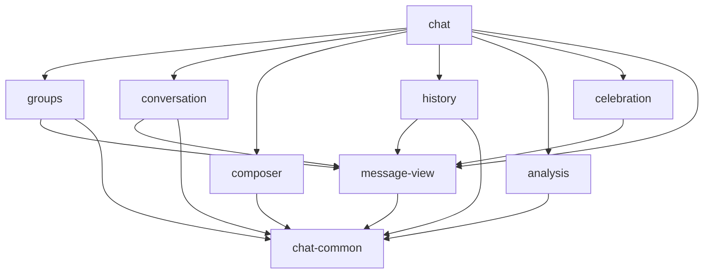

# 群聊页面模块化详细设计

状态：待评审的实施设计。本文中的接口是建议契约，不代表代码已经实现。

## 1. 设计原则与取舍

按功能聚合状态、DOM、事件和请求处理；公共部分只提取实际复用的函数。一个功能模块通过少量操作隐藏内部细节。保留一个入口负责组装和页面级调度。

选用 ES Modules 的理由是浏览器可直接加载，无需引入构建步骤，依赖可从 import 直接定位。页面由现有 HTTP 服务提供，不以双击 HTML 的文件协议运行作为兼容目标。

未采用的方案：

| 方案 | 未采用原因 |
| --- | --- |
| 多个经典脚本通过 window 共享对象 | 保留共享状态、加载顺序和隐式依赖问题 |
| 按 state、events、render、api 横向拆分 | 一个功能修改通常仍需跨多个文件理解 |
| 全局事件总线 | 当前协作关系有限，显式回调足够且容易追踪 |
| 通用请求取消、弹窗、分页基类 | 不同功能的生命周期不同，抽象会扩大接口 |
| 前端框架与打包工具迁移 | 超出本次模块化目标，增加部署和测试变量 |

## 2. 源码布局与责任归属

源码根目录为 `src/main/resources/static/chat/`。

```text
chat.js
groups.js
conversation.js
composer.js
history.js
analysis.js
celebration.js
message-view.js
chat-common.js
```

`index.html` 保留现有节点、ID、类名和第三方脚本，只调整入口脚本为 `type="module"`。图片、动画、表情映射、Markdown 解析器和净化器保持原部署位置。

| 模块 | 迁入的主要函数或行为 | 独占状态和资源 |
| --- | --- | --- |
| chat | initialize、refreshView、切群协调、登录检查、二维码轮询、沉浸模式、页面跳转 | 当前群快照、初始化状态、页面轮询、登录状态、二维码资源 |
| groups | renderGroups、filterGroups、groupPreview、refreshGroups、groupsEqual、sameAdmins | 群列表、搜索输入、刷新锁、列表 DOM |
| conversation | renderMessages、loadMessages、refreshMessages、catchUpMessages、maybeLoadEarlierMessages、跟随图标、群标题与数量 | 当前群副本、消息 Map、游标、请求代次、加载锁、滚动跟随、MutationObserver |
| composer | 表情面板、插入表情、附件选择和粘贴、sendMessage、sendAttachment、发送提示 | 发送目标、发送状态、附件、Object URL、输入 DOM |
| history | resetHistory、queryHistory、上下文双向加载、搜索结果、captureHistory | Historical Browse 会话、筛选、分页、上下文游标、请求版本、弹窗 DOM |
| analysis | 列表、详情、submitAnalysis、parseSseEvent、Markdown 渲染、元数据、下载 | Analysis 会话版本、视图请求版本、报告、流读取器、取消控制器、待渲染帧 |
| celebration | 名单、基线、到达判断、浮层、图集、动画 | 名单和已见时间、草稿、群代次、活动动画、延时和绘制资源 |
| message-view | avatar、messageElement、messageMedia、文本与表情、微博卡片、openImage | 共用原图查看器及其事件，其余按参数渲染 |
| chat-common | fetchJson、日期格式化、compareMessages、滚动锚点 | 无业务状态；允许复用 Intl 格式化器 |

登录暂不单独拆文件，动画暂不进一步拆分。只在后续复杂度实际增加时重新评估。

## 3. 模块依赖与初始化



图中箭头表示允许的直接依赖。功能模块不得反向导入 chat，也不直接导入其他功能模块。跨功能协作经入口注入的回调完成。groups 和 celebration 使用 message-view 的头像函数；message-view 不因此反向认识它们。

所有模块在导入时只声明常量、函数和格式化器，不绑定 DOM 事件、不读取页面状态、不开始网络请求。页面入口在 DOMContentLoaded 后执行一次 bootstrap，届时现有 defer 脚本已经执行；表情映射、marked、DOMPurify 在初始化时读取，避免模块求值时过早捕获空依赖。

bootstrap 只创建一次模块并绑定一次事件。重新扫码成功后的 initialize 仅重新加载业务数据，不重复 bootstrap，不创建第二个轮询器或 MutationObserver。现有静态资源测试服务器已经按 JavaScript 后缀返回正确 MIME，需要新增模块资源加载断言。

## 4. DOM 与状态所有权

各模块在自己的初始化函数中查询所负责的 DOM。不新建全局 elements.js，不把整个元素字典或 state 作为参数传递。

- chat 拥有历史和分析的入口按钮、群选择协调、登录区域、沉浸开关与页面导航。模块内部拥有弹窗关闭、表单、分页等事件。
- conversation 拥有主会话标题、头像、人数、消息数量、消息区、跟随提示和新消息按钮。
- composer 拥有编辑器、表情按钮及面板、附件按钮及预览，不拥有历史和分析按钮，即使它们位于同一工具栏。
- message-view 拥有原图查看器。会话和历史共享一个实例，避免注册两份查看器事件。
- groups 列表不替入口决定初始化选择哪个群；本地最后选群恢复由 chat 负责。

群对象由 groups 提供快照，admins 数组复制；其他模块视为只读。消息对象同样只读。conversation 不暴露 Map；必要的消息快照以数组返回，不允许调用方修改容器。无需为了强制只读而引入深度冻结或代理。

## 5. 模块公开接口

以下表格只列跨模块需要的操作；私有请求、渲染和校验函数不导出。实际实现可统一命名，但不得通过增加几十个导出函数把原闭包整体暴露。

### 5.1 groups

| 接口 | 契约 |
| --- | --- |
| createGroups（messageView、onSelect、onGroupsChanged） | 绑定列表和搜索事件，复用头像展示，不自动开始轮询 |
| load（） | 获取并渲染群列表，返回群快照数组；初始失败向入口报告 |
| refresh（） | 读取本地群数据，自带刷新锁；失败保留原列表并记录现有提示或日志 |
| setSelected（gid） | 只更新选中样式，不触发 onSelect |
| onSelect（group） | 用户点击产生一次回调；提供群快照 |
| onGroupsChanged（groups） | 元数据变化后通知入口；不启动消息采集 |

load 和 refresh 共享内部请求去重，初始化与定时刷新不互相覆盖。选中群的元数据变化时，入口更新 currentGroup 并调用 conversation.updateGroup。管理员元数据即时刷新导致已渲染消息变色不作为本次新功能。

### 5.2 conversation

| 接口 | 契约 |
| --- | --- |
| createConversation（messageView、三个消息回调、onSenderClick） | 创建一次会话模块，绑定滚动和新消息按钮 |
| open（group） | 同步切换内部群、清空旧消息与 DOM、递增请求代次，再异步加载首屏 |
| updateGroup（group） | 仅更新当前群元数据和标题，不清空消息和游标 |
| refresh（） | View Refresh；忙碌或页面隐藏时依照既有策略跳过，不启动后台采集 |
| markAway（） | 暂停跟随，设置回来后的 Catch-up 标记 |
| refreshAfterSend（gid） | 仅在发送所属群仍为当前群时应用现有发送后刷新行为 |
| getMessagesSnapshot（） | 返回当前消息数组，供新增庆祝成员时建立基线 |

三个回调分别为 onInitialMessages、onEarlierMessages、onNewMessages，参数均为 gid 和消息数组。它们只能在群代次校验通过、消息已经合并后发出。主会话保留自己的去重和排序，不由庆祝模块反推来源。

跟随状态的修改通过私有 setFollowing 更新图标，不再在共享对象属性存取器中隐式操作 DOM。媒体回调必须校验创建时的群代次，防止已脱离 DOM 的旧图片加载改变新会话滚动。首屏媒体强制跟随的既有语义暂保留，是否允许用户滚动覆盖它属于另行修复。

### 5.3 composer

| 接口 | 契约 |
| --- | --- |
| createComposer（onSent） | 管理输入、表情、附件及所有发送相关事件 |
| setGroup（gid） | 更新下一次发送的目标，不改变正在发送的请求目标 |
| onSent（gid） | 只有成功发送响应触发，入口按群归属调用会话刷新 |

一次发送开始时捕获 gid、文本或附件引用，之后不读取外部可变 currentGroup 构造请求。不自动重发，不因用户切群取消有外部副作用的发送请求。

草稿继续保持当前页面共享的行为，不新增按群草稿。HTTP 409 继续保留内容、显示已发送但同步失败的提示；不得因为模块化改为清空或静默重试。Object URL 在替换或删除附件时释放；附件和文本发送只在模块内部共享发送锁。

### 5.4 history

| 接口 | 契约 |
| --- | --- |
| createHistory（messageView） | 管理 Historical Browse 的弹窗内部交互 |
| open（group） | 捕获群信息，重置筛选与上下文，然后显示弹窗 |
| close（） | 关闭弹窗，使旧请求失效；下次打开仍重置 |

历史窗口内部使用自己的群和管理员快照，不能查询主会话 currentGid。搜索结果和上下文沿用独立分页，不复用主会话 Map。

已有请求版本用于查询和上下文切换；关闭也使旧结果失效。captureHistory 的返回提示受同一会话版本约束，但关闭不等于取消已提交的 Historical Capture。同步返回仍只说明请求已接受，用户重新查询查看结果。

### 5.5 analysis

| 接口 | 契约 |
| --- | --- |
| createAnalysis（） | 封装全部 Analysis 展示与流式处理 |
| open（group） | 创建新弹窗会话，清空旧报告，加载当前群列表 |
| close（） | 使会话失效，取消客户端读取和待渲染帧，关闭弹窗 |

会话版本与视图请求版本分开：前者识别群和弹窗打开周期，后者识别列表、详情之间的导航。不能让列表请求递增一个共享计数后，误杀同一会话中有效的生成完成处理。

建议状态为 list、detail-loading、detail、generating。开始生成使之前列表或详情读取失效；生成期间禁用表单和返回列表入口，关闭按钮仍可用。完成后直接使用 done 事件返回的完整报告展示详情，不再先刷新列表再额外请求同一详情；返回列表时读取最新列表。该调整需要独立行为测试，避免无效请求和流式帧覆盖最终报告。

所有响应、catch、finally、requestAnimationFrame 回调在写入 DOM 前校验所属会话和操作。关闭时取消当前 fetch 或 reader，释放读取器并取消帧。客户端取消不保证停止后端 AI 生成或保存，不增加后端接口，不向用户宣称已取消后端任务。

Markdown 渲染和净化仍留在 analysis 内；其依赖缺失时的安全降级改进单列后续事项，不作为机械提取的一部分。

### 5.6 celebration

| 接口 | 契约 |
| --- | --- |
| createCelebration（messageView、getMessagesSnapshot） | 封装现有持久化、浮层和动画，复用头像展示 |
| setGroup（gid） | 更新名单展示，切群时关闭旧浮层并取消活动动画 |
| seed（gid、messages） | 首屏和上翻消息只建立或提高基线 |
| acceptArrivals（gid、messages） | 按时间顺序处理新到达消息，执行现有间隔判定 |
| openMember（gid、member、anchor） | 展示成员配置；新增成员用当前消息快照建立基线 |

名单与已见时间保持现有 localStorage 键和值结构。没有可靠前序时间时先建立基线，不因拆分恢复成首次见到立即庆祝。此行为以现有实现及测试为准，领域词汇中较宽泛的“未见过即长时间沉默”不作为本次改写触发算法的依据。

保留现有动画 generation 和 cancel，不增加跨模块动画调度器。素材缓存和绘制函数留在本文件内。

### 5.7 message-view 与 chat-common

message-view 提供一个工厂实例，公开 createMessageElement 与 createAvatar。消息渲染选项包含 isAdmin、highlighted、onMediaLoad、onSenderClick。回调缺省表示没有对应行为，例如历史消息的姓名保持纯文本。

message-view 不读取 groups、currentGid 或庆祝名单。头像链接、媒体代理地址、文字节点转义、微博卡片、视频播放及查看器行为保持现状。表情选择面板留在 composer，消息中的表情显示留在 message-view，双方读取现有表情映射。

chat-common 仅导出被多个模块实际使用的函数。calendarMonthsAgo 若只有历史使用，则放在 history；搜索摘要与关键词高亮也留在 history。滚动锚点函数必须显式接收 container，移除默认全局消息容器。常量留在使用它的模块，不建立常量大全。

fetchJson 保留通用 HTTP 状态检查与 JSON 读取；发送的 HTTP 409、历史采集的无响应体、分析流的 SSE 不强行通过它处理。允许透传原生 fetch 的 options，包括 signal，不新增请求框架。

## 6. 入口执行顺序

### 首次打开

1. bootstrap 创建共用 message-view 和各功能模块，注入回调，绑定页面事件一次。
2. initialize 获取群列表，恢复最后选择的群或选择第一个群。
3. 入口同步保存当前群、更新群选中状态和编辑器目标、设置庆祝群。
4. conversation.open 同步清除旧视图，再加载首屏；首屏成功回调只建立庆祝基线。
5. 页面继续沿用现有 3 秒 View Refresh 调度，登录检查节奏先保持现有实现。

### 用户切群

入口先更新 currentGroup，然后依次更新 groups 选中、composer 目标，关闭 history 和 analysis，切换 celebration，再调用 conversation.open。入口不等待网络完成才建立新群归属。快速 A → B → A 的三次 open 使用三个不同代次，仅比较 gid 不足以防止旧请求写回。

弹窗本身为模态，普通点击不能在打开时操作背后群列表；仍要覆盖初始化重载或程序触发群变化时的归属处理。

### 元数据刷新

groups 在本地数据变化时发出群列表快照，入口查找当前群并更新标题数据。metadata 更新不重新 open 会话，不重置草稿或滚动。群消失时保持现有行为，不新增自动跳群策略。

### 页面隐藏与返回

隐藏时入口调用 conversation.markAway。恢复可见或获得焦点时调用统一 refreshView；各模块自己的刷新锁防止重复读取造成重叠。Catch-up 保留阅读位置，完成后通过新消息按钮恢复跟随。此次拆分不把后台采集纳入前端轮询。

### 登录成功

保留当前同步扫码请求及二维码显示，停止二维码轮询后重新 initialize。模块实例复用，避免重复绑定事件。是否进一步修复二维码延迟任务或登录检查间隔属于独立事项。

## 7. 异步失效和资源约束

| 资源 | 所有者 | 失效或清理时机 |
| --- | --- | --- |
| 当前消息请求 | conversation | 每次 open 递增群代次，旧响应和旧媒体回调不得写入 |
| 历史查询与上下文请求 | history | 新查询、上下文切换、关闭或重新打开 |
| 分析列表、详情和生成流 | analysis | 新操作、返回列表、关闭或重新打开；finally 同样检查版本 |
| 待渲染动画帧 | analysis | 关闭、操作替换或最终报告接管展示 |
| 附件 Object URL | composer | 附件替换或移除 |
| 庆祝动画、延时、图集等待 | celebration | 切群或跳过；异步加载后再次检查 generation |
| 页面轮询和消息 MutationObserver | chat、conversation | 单次初始化创建，重新登录不重复注册 |

不要求所有模块实现统一 destroy。当前页面没有 SPA 挂载卸载流程，局部资源在实际生命周期处清理，避免增加无人调用的接口。

## 8. 迁移策略与变更隔离

按可验证功能提取，不先建立一套空模块再等待所有迁移完成。第一票把模块入口和真实消息展示一起打通；后续每票替换一整项功能及其事件，立即删除被替代的原函数和状态。

分析、历史、庆祝、编辑器和群列表完成前，入口允许暂时保留尚未迁移的原会话状态。已迁移模块不接收整个旧 state，仅接收最终形状的参数或回调。这样最终迁移 conversation 时，其他功能不需要二次重写。

机械迁移与关联缺陷修复分开提交；每次迁移先证明既有正常路径保持，再添加失败用例并修复生命周期问题。回滚以该票提交为单位，不删除本来存在的无关代码。

建议关联修复：

- Analysis 旧详情或生成流覆盖新弹窗内容，旧 finally 解锁新请求；生成期间的视图竞争。
- 切群立即清理旧消息 DOM，旧媒体回调不影响新会话。
- 历史采集提示与所属弹窗会话一致；切群关闭庆祝旧浮层。
- 发送成功回调携带起始群，仅在仍为当前群时影响会话刷新和跟随。

这些是本设计明确建议的局部行为变化，任务草案需评审通过才执行。

## 9. 暂不纳入的审查事项

| 已知问题 | 后续归属 | 本次边界 |
| --- | --- | --- |
| 中文输入法 Enter 误发 | composer | 单独修复，不混入提取提交 |
| 普通刷新超过 50 条产生缺口 | conversation | 单独设计增量读取策略 |
| 首次消息失败后恢复未建立历史游标及庆祝基线 | conversation | 单独补恢复测试和初始化逻辑 |
| 首屏媒体完成后强制贴底覆盖用户滚动意图 | conversation | 单独定义跟随行为 |
| Markdown 净化器缺失时的不安全降级 | analysis | 单独安全修复 |
| 长期会话的消息和 DOM 数量增长 | conversation | 先量测，再决定窗口或虚拟列表 |
| 登录检查按轮询次数计数以及二维码晚到回调 | chat | 单独调整时序，不改变本轮登录协议 |

上述问题不得在迁移时被隐藏为行为保持，也不算本次成功标准已经解决。执行者发现新的问题应记录，不顺手扩大范围。

## 10. 验证矩阵

沿用 Java Playwright 浏览器测试和本地 HttpServer 模拟接口，不新增 JavaScript 测试栈。新增测试通过用户可见界面和可控延迟响应验证，禁止为测试把内部状态挂到 window。

| 场景 | 需要验证的结果 | 主要任务 |
| --- | --- | --- |
| 模块启动 | 所有 import 成功，脚本 MIME 正确，第三方依赖就绪，无 pageerror | 01 |
| 消息展示 | 文本、链接、表情、管理员、系统消息、卡片、附件、原图和视频保持一致 | 01 |
| 分析 | 列表、详情、下载、分块 SSE、关闭重开、过期详情、旧 finally 与待渲染帧 | 02 |
| 历史 | 筛选、分页、目标定位、双向上下文、滚动锚点、历史采集返回及旧提示 | 03 |
| 庆祝 | 名单持久化、首屏只建基线、首次无可靠基线、多条到达、切群取消 | 04 |
| 编辑器 | 文本与媒体成功、失败和 HTTP 409 保留、粘贴、表情、切群时发送归属 | 05 |
| 群列表 | 初始失败重试、空列表、筛选、恢复选群、刷新数量和当前群元数据 | 06 |
| 主会话 | 快速切群、空群与失败响应、上翻锚点、跟随、隐藏返回追平、旧媒体事件 | 07 |
| 集成 | 登录成功后仅一套事件与轮询、打包模块资源、完整群聊路径 | 08 |

当前 UI 测试入口为 `src/test/java/xyz/fz/weibo/ui/GroupChatPageTest.java`。分析测试可另建同包测试类，只有出现实际复用时才提取公共夹具；不要为预期复用先重构整套测试服务器。

推荐命令：

```text
mvn -Dtest=GroupChatPageTest test
mvn test
mvn package
```

若新增独立分析测试类，执行其定向测试。package 包含仓库现有 7-Zip 打包插件；缺少可执行文件时区分环境问题与模块问题，记录失败原因，不跳过后声称打包通过。测试命令是实施时要求，本轮文档交付并未执行这些业务测试。

需要新增的所有 Java @Test 方法使用 snake_case，辅助方法保持 camelCase。新注释与日志遵守仓库中文标点和间距约定。

## 11. 验收与决策留痕

每票记录实际测试命令、结果及环境限制。最终检查无循环 import、无遗留副本、无模块级启动副作用、无全局状态逃生口。目标是职责稳定，不以文件行数或函数数量强制拆分。

本设计评审通过后，实施完成的架构决策再写入正式 ADR，并链接最终实现与实际取舍；不在本轮把草案冒充已采用架构。
