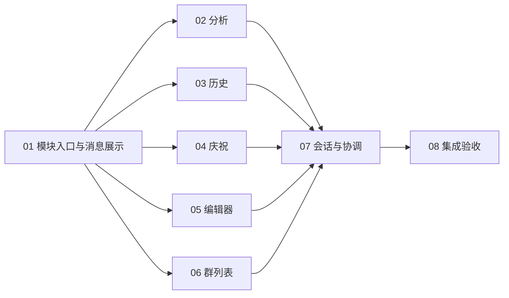

# 群聊页面模块化任务计划

状态：待评审。以下是完整任务草案，尚未发布为可领取任务。

## 评审范围

采用八票功能切片，每票都包含可运行的页面路径和对应验证。第一票含必要的模块入口预重构，不修改后端协议。分析、历史、庆祝、编辑器和群列表之间没有硬性业务依赖，可在第一票之后开始；由于都涉及入口文件，推荐在当前分支逐票实施，避免同时编辑入口。

本方案建议将跨会话的旧响应、旧 DOM 和旧浮层清理作为关联修复，以独立提交实现。输入法、普通刷新缺口、首屏失败恢复等其他问题另行处理。完整范围见 [需求](PRD.md) 和 [详细设计](DESIGN.md)。

## 任务列表

| 编号 | 标题 | Blocked by | 可演示的交付 |
| --- | --- | --- | --- |
| 01 | 模块入口与共用消息展示 | 无 | 原页面通过模块脚本启动，会话和历史媒体展示正常 |
| 02 | 群聊分析独立会话 | 01 | 分析列表、流式生成、详情和下载完整工作，旧响应不覆盖新会话 |
| 03 | 历史浏览与历史采集独立会话 | 01 | 筛选、上下文双向翻页、历史采集保持独立，旧提示不污染新弹窗 |
| 04 | 回归庆祝独立管理 | 01 | 名单配置、基线、触发、动画及切群取消独立工作 |
| 05 | 编辑器与媒体发送独立管理 | 01 | 文本、图片、视频及表情完整发送，保留既有失败语义 |
| 06 | 群列表与元数据独立管理 | 01 | 群搜索、选择、重试和元数据刷新正常，不打断会话 |
| 07 | 当前会话与页面协调收口 | 02、03、04、05、06 | 分页、追平和跟随正常，快速切群无旧视图串入 |
| 08 | 模块化交付验收与决策记录 | 07 | 完整流程与打包通过，无循环依赖、重复监听或原代码副本 |

## 依赖图

01 为后续票建立真实可运行的模块加载和共用展示基础。07 必须等五个功能模块落地，才能让入口从直接访问它们的原状态切换成最终接口。08 依赖 07 即已传递依赖前面各票，不重复列全部阻塞项。

每票均需保持绿色，不采用只有最后整合才可运行的批量搬迁。08 的作用是跨功能和打包验收，不是把所有测试留到最后。

## 草案文件

1. [模块入口与共用消息展示](drafts/01-module-entry-message-view.md)
2. [群聊分析独立会话](drafts/02-analysis-session.md)
3. [历史浏览与历史采集独立会话](drafts/03-historical-browse.md)
4. [回归庆祝独立管理](drafts/04-return-celebration.md)
5. [编辑器与媒体发送独立管理](drafts/05-composer-media-send.md)
6. [群列表与元数据独立管理](drafts/06-group-list.md)
7. [当前会话与页面协调收口](drafts/07-conversation-coordination.md)
8. [模块化交付验收与决策记录](drafts/08-integration-verification.md)

## 发布与执行方式

本仓库使用本地 Markdown 作为 tracker。依据用户指定的 to-tickets 技能，先评审粒度、阻塞关系和是否合并或细分，再发布任务。当前草案使用 `needs-info`，仅表示任务计划待确认，不表示实现信息缺失。

确认后将每份草案迁入 issues 目录，保持编号与正文，状态更新为 ready-for-agent，并同步本文件链接和评审状态。每票继续保留 Blocked by，状态为 ready-for-agent 不代表可以忽略未完成的阻塞票。只推进所有阻塞项已完成的票，不修改任何既有父任务。

执行时先读取需求和设计，再按票交付。结构迁移和行为修复采用独立提交。每票末尾记录验证结果，若实际接口改变，同步详细设计，不只在聊天中口头说明。

## 待确认

- 八票粒度是否合适，是否需要合并或再拆分。
- 阻塞关系是否符合预期，特别是 07 在各功能模块之后收口。
- 是否接受设计中列出的关联生命周期修复，并继续将其他审查问题留作后续工作。
