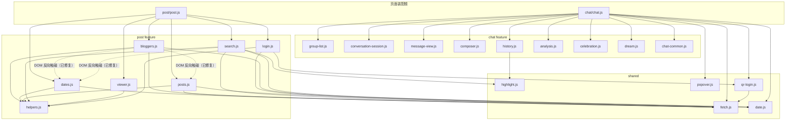

# Frontend Architecture Review（第二轮）

- 日期：2026-09-12
- 分支：`review/frontend-architecture`
- 范围：`src/main/resources/static/`（chat / post / shared / video-player.html，约 6000 行）
- 说明：第一轮审查（本目录 `issues/01-13`）已落地。本轮在保留原技术栈与结构的前提下复查，遵守「简单优先、外科手术式修改、不过度架构」。

## 当前架构

依赖方向整体健康：`Page → Feature → Shared` 单向，无循环依赖、无跨 feature import、shared 无反向依赖。

## 做得好的地方

1. **shared 五个模块全部真实复用**：fetch（两页）、date（两页）、highlight（post/search + chat/history）、popover（chat 三处）、qr-login（两页）。没有垃圾桶化。
2. **装配根 + factory 注入模式贯彻一致**，post 页 post.js 是纯装配的范本。
3. **conversation-session 的滑动窗口虚拟化**有完整设计注释，version/gid 双守卫防竞态，orderedCache 连续块拼接避免全量重排。
4. **富文本渲染纵深防御**：posts.js 走 DOMParser + DOM 白名单清洗（script/iframe/on*/javascript:），highlight.js 只操作文本节点不走 innerHTML；analysis 的 marked+DOMPurify 在 `ensureMarkdownLibs` 门控下使用，库加载失败会走错误分支，不会降级为未消毒 innerHTML。
5. **UI 测试固化行为契约**（Playwright 103 用例），几处反直觉决策（如消息加载静默失败 + 3 秒轮询自愈）有测试与注释双重说明。
6. **CSS 令牌化**，两套皮肤各自成文、不混用，`!important` 仅 2 处且合理（沉浸模式隐藏、reduced-motion）。

## P0 Critical

无。安全面逐项核对：innerHTML 两条路径（post 正文、analysis markdown）均有清洗且失败不降级；message-view 的 `link.href` 只接受 `https?://` 正则匹配结果；dream.js 的 uid 经数字校验才拼 URL；localStorage 只存展示偏好与名单，无敏感数据。

## P1 High

无。监听器均为页面生命周期且无重复绑定；popover 类监听提供解绑函数；qr-login 的定时器在 finally 清理；analysis 的 AbortController/reader/renderFrame 有统一的 `cancelOperation` 回收；conversation 的轮询竞态由 version + gid 双守卫兜住。

## P2 Medium

### P2-1 post 页跨模块 DOM 反向触碰

- **Location**：`post/bloggers.js` `onBloggerChanged()`（`datesList.querySelector(".month-group")`、直接 `posts.replaceChildren()`、写 `feedCount/postsState`）；`post/search.js` `jumpToPost()`（`datesList.querySelector(".month-group[data-month=...]")` 并手动展开年/月分组）。
- **Problem**：博主切换与搜索跳转的编排逻辑直接操作 dates 模块渲染出的 DOM 结构（`.month-group[data-month]`、`.date-item[data-date]`、`.year-group.open`），并直接清空 posts 模块的列表与状态行。日期树的 class/data 约定成为三个模块的公共知识。
- **Evidence**：`bloggers.js:112-127`、`search.js:145-155`。
- **Why**：dates 渲染结构一变（如改名 data-month），bloggers 与 search 同时静默失效；这正是「模块边界由 DOM 约定而非 API 定义」的耦合。
- **Impact**：日期时间轴的任何重构都要联动改三个文件；测试只能覆盖到最终行为，中间约定无契约。
- **Recommendation**（已实施）：dates 暴露 `selectFirstDate()` / `revealDate(dateStr)` / `setStatus(message)`，posts 暴露 `clear()` / `showStatus(message)`；bloggers、search 只调 API，删除对 `datesList/posts/postsState/feedCount` 元素的依赖，`toggleGroup` 收回模块内部。

### P2-2 chat.js 装配根职责超载

- **Location**：`chat/chat.js` `bootstrap()`（350 行）。
- **Problem**：纯装配之外内联了四个可独立变化的功能：表态开关（`loadAttitudes/applyAttitudesToggle`，含 API 拉取、localStorage、aria 状态）、表情面板（`toggleEmojiPanel/insertEmoji`，懒构建 + 插入光标 + dismiss）、沉浸模式、登录检查。对比 post.js 是 119 行纯装配。
- **Evidence**：`chat.js:176-222`（表情 + 表态两大段）、`chat.js:196-222`。
- **Why**：表态的独立变化原因至少有三个（开关持久化策略、拉取时机、失败降级），表情面板有懒构建与插入行为；它们与「模块装配」互不相关，改任何一个都要在读 350 行装配代码里找位置。
- **Impact**：装配根持续膨胀（对比 post 页已示范的目标形态）；无法对表态逻辑单独理解或测试。
- **Recommendation**（已实施）：抽出 `chat/attitudes.js` 与 `chat/emoji-panel.js` 两个 factory，chat.js 回归纯装配。沉浸模式（10 行）与登录检查（节流轮询）体量小、与页面生命周期强绑定，保留在装配根，不为拆而拆。

### P2-3 网络边界不统一

- **Location**：chat 侧 4 个 feature 由页面注入 `fetchJson`（group-list/conversation/analysis/history），post 侧 6 个 feature 直接 import；`chat.js` `checkLoginStatus()` 与 `history.js` `capture()` 绕过 fetchJson 用裸 fetch。
- **Problem**：两种依赖风格并存；同页内同一端点 `/weibo/login/status` 在 post/login.js 走 fetchJson、在 chat.js 走裸 fetch。
- **Evidence**：`chat.js:299-307` vs `post/login.js:21-32`；`chat.js:135-142` vs `post/bloggers.js:2`。
- **Why**：注入式与直接 import 各有取舍，但同一代码库应二选一；裸 fetch 丢弃后端错误体 msg，错误处理策略分叉。
- **Impact**：新人无法判断新 feature 应遵循哪种风格；login status 的失败处理在两页行为不一致（一个 warn、一个静默）。
- **Recommendation**（已实施/部分保留）：chat.js `checkLoginStatus` 改用 fetchJson（同端点与 post 页对齐）；`history.js capture` 保留裸 fetch——`/chat/since` 返回 204 No Content，`fetchJson` 的 `response.json()` 会在空响应体上抛语法错误，此处裸 fetch 是正确的，补充注释说明；post 侧直接 import 的风格保留（两页各自内部一致即可，不为统一而大改签名）。

## P3 Low

1. **日期拼接重复**：`shared/date.js` 已导出 `toQueryDateTime/toQueryEndTime`（posts.js 在用），`bloggers.js:235-236`、`search.js:60-61` 用模板字符串重复实现。（已改为复用。）
2. **静默 catch 无 debug 记录**：`post/login.js` `catch (_)`（登录检测失败完全无痕迹）、`chat.js` `initialize()` 的 `catch {}`（群列表加载失败不留日志）。（已补 `console.warn`。chat 消息加载的静默是测试固化的决策，不算此项。）
3. **DOM 作为筛选数据源**：`bloggers.js` `filterBloggers()` 依赖 `row.dataset.name`——展示级过滤可接受，但博主名在 state 与 DOM 双份；量级小，保留现状。
4. **大模块的两个变化原因**：`celebration.js`（451 行）混合「名单/弹层管理」与「怪兽动画编排」；`conversation-session.js`（547 行）混合「消息存储」与「虚拟化窗口」。两者内部注释清晰、联动紧密，拆分收益低于风险，暂不动；下次触碰时优先把动画编排或存储层独立成文件。
5. **可访问性小项**：`composer-attachment` 容器 `tabindex=0` + Enter 发送但无 role，读屏不识别为可操作；celebration/dream 弹层无焦点管理。量级小，保留现状，后续做 a11y 专项时一并处理。

## 明确不做的（避免过度设计）

- 不给消息加载失败加提示/retry：`GroupChatPageTest.keeps_the_group_visible_when_messages_fail_and_recovers_by_polling` 已固化「静默失败 + 轮询自愈」为产品决策。
- 不把 post 侧 fetchJson 改为注入（或反之）：两页各自一致即可。
- 不为 1 行的 `pickElements` 建共享模块。
- 不引入 domain/application/repository 等分层，不改 class 化。

## Refactoring Roadmap（收益 / 风险 / 成本）

| 序 | 事项 | 收益 | 风险 | 成本 |
|---|---|---|---|---|
| 1 | 日期拼接复用 shared/date | 低 | 极低 | 极低 |
| 2 | 静默 catch 补 warn | 中 | 极低 | 极低 |
| 3 | chat login status 统一 fetchJson；history capture 补注释 | 中 | 低 | 低 |
| 4 | dates/posts 显式 API 化，bloggers/search 去 DOM 触碰 | 高 | 中 | 中 |
| 5 | chat.js 抽出 attitudes / emoji-panel | 高 | 中 | 中 |

本轮 1-5 全部实施，Playwright UI 测试（PostPageTest + GroupChatPageTest 共 103 用例）回归通过。
