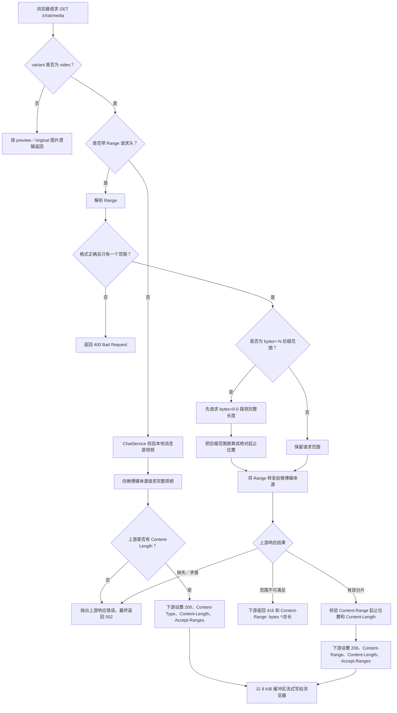
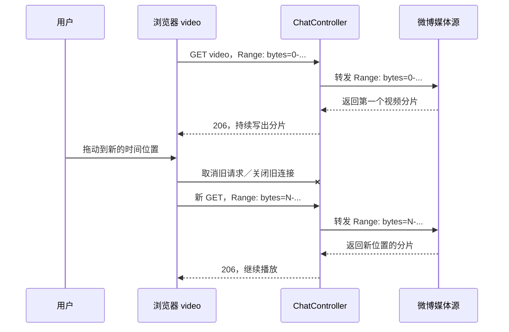

# HTTP Range 与本项目视频流实现

本文解释 HTTP Range 的协议含义，以及它在本项目群视频接口中的完整处理过程。对应接口为：

```http
GET /chat/media?gid={gid}&mid={mid}&variant=video
```

主要代码位置：

| 层次 | 文件 | 职责 |
| --- | --- | --- |
| HTTP 入口 | `src/main/java/xyz/fz/weibo/controller/ChatController.java` | 判断有无 `Range`、校验分片响应、设置下游状态码和响应头、传输字节流 |
| 业务校验 | `src/main/java/xyz/fz/weibo/service/ChatService.java` | 校验群、消息和视频类型，根据本地消息取得媒体引用 |
| 上游接口 | `src/main/java/xyz/fz/weibo/api/GroupMediaApi.java` | 将请求头转发给微博媒体下载接口 |
| HTTP 客户端 | `src/main/java/xyz/fz/weibo/client/WeiboHttpClient.java` | 使用 `RestTemplate.execute` 流式读取微博响应 |
| 接口样例 | `CHAT_API.http` | 手动发送完整视频请求和 Range 请求 |
| 浏览器测试页 | `src/main/resources/static/video-player.html` | 测试播放器、Range 下载和非 Range 完整下载 |
| 回归测试 | `src/test/java/xyz/fz/weibo/controller/ChatControllerTest.java` | 验证 `200`、`206`、`416`、各种 Range 形式和客户端断开 |

协议依据是 [RFC 9110 第 14 章：Range Requests](https://www.rfc-editor.org/rfc/rfc9110.html#section-14)。

## 1. Range 解决什么问题

普通 `GET` 请求没有 `Range` 时，客户端请求整个资源。假设视频有 100 MB，即使用户只想从中间开始播放，服务器也可能需要从头传输大量无用数据。

Range 允许客户端表达：

> 我只需要这个资源的某一段字节。

例如：

```http
GET /chat/media?gid=101&mid=100&variant=video HTTP/1.1
Range: bytes=0-1048575
```

这里请求的是第 `0` 到第 `1048575` 个字节。两个端点都包含在结果中，因此实际长度为：

```text
1048575 - 0 + 1 = 1048576 字节 = 1 MiB
```

Range 描述的是字节位置，不是视频时间。浏览器和视频容器根据元数据、码率和索引，把“跳到第 30 秒”换算成它需要读取的字节范围。

RFC 9110 将 `Range` 定义为对 `GET` 语义的修饰：客户端请求所选资源表示的一段或多段数据，而不是整个表示。服务器原则上可以忽略 `Range` 并返回完整的 `200`，但支持 Range 能明显提高大文件的随机访问和断点恢复效率。

## 2. 四个关键响应结果

### 2.1 不带 Range：`200 OK`

请求：

```http
GET /chat/media?gid=101&mid=100&variant=video
```

典型响应：

```http
HTTP/1.1 200 OK
Content-Type: video/mp4
Content-Length: 10000000
Accept-Ranges: bytes

[完整的 10000000 字节视频]
```

含义：

- `200` 表示返回完整视频。
- `Content-Length` 是完整视频的字节数。
- `Accept-Ranges: bytes` 告诉客户端该资源支持按字节请求。
- 完整响应不应带 `Content-Range`。

### 2.2 合法 Range：`206 Partial Content`

请求：

```http
Range: bytes=0-1048575
```

假设完整视频为 `10000000` 字节，典型响应为：

```http
HTTP/1.1 206 Partial Content
Content-Type: video/mp4
Content-Length: 1048576
Content-Range: bytes 0-1048575/10000000
Accept-Ranges: bytes

[第 0 到第 1048575 个字节]
```

含义：

- `206` 是成功响应，不是错误。
- `Content-Range` 的格式是 `bytes 起点-终点/完整长度`。
- `Content-Length` 是本次响应体的分片长度，不是完整视频长度。
- 分片长度必须满足 `终点 - 起点 + 1`。

RFC 9110 对 [`206 Partial Content`](https://www.rfc-editor.org/rfc/rfc9110.html#section-15.3.7) 的定义就是成功完成一个 Range 请求并传输一个或多个部分。

### 2.3 超出范围：`416 Range Not Satisfiable`

假设视频总长只有 `10000000` 字节，而客户端请求：

```http
Range: bytes=20000000-
```

响应应类似：

```http
HTTP/1.1 416 Range Not Satisfiable
Content-Range: bytes */10000000
Accept-Ranges: bytes
```

`bytes */10000000` 不表示返回了某段内容，星号表示没有可返回的范围，斜杠后的数字告诉客户端完整资源长度。RFC 9110 的 [`416 Range Not Satisfiable`](https://www.rfc-editor.org/rfc/rfc9110.html#section-15.5.17) 也建议在响应中携带这个完整长度。

### 2.4 本项目校验失败：`502 Bad Gateway`

本项目不是视频的最终存储端，而是微博媒体源前面的网关。如果微博媒体源返回的数据无法证明它就是客户端请求的那一段，例如：

- 缺少有效的 `Content-Range`；
- 返回的起止位置与请求不一致；
- `Content-Length` 与 `end - start + 1` 不一致；
- 长度探测结果不合法；

Controller 会抛出 `WeiboException`，由全局异常处理映射为 `502`。这是上游协议或内容不可信，不应伪装成成功的 `206`。

## 3. Range 请求的三种常见写法

假设完整资源长度为 `1000` 字节，有效下标是 `0` 到 `999`。

| 写法 | 含义 | 实际范围 |
| --- | --- | --- |
| `bytes=100-199` | 指定起点和终点 | `100-199`，共 100 字节 |
| `bytes=800-` | 从指定起点直到资源末尾 | `800-999`，共 200 字节 |
| `bytes=-200` | 资源最后 200 字节 | `800-999`，共 200 字节 |

协议还允许在一个请求中写多个范围：

```http
Range: bytes=0-99,200-299
```

这种响应通常需要 `multipart/byteranges`。当前项目为了保持实现简单且满足浏览器视频播放需求，只接受一个 Range；`HttpRange.parseRanges` 解析后如果数量不是 `1`，接口返回 `400 Bad Request`。

## 4. 本项目的整体流程



## 5. 结合代码逐步理解

### 5.1 Controller 先分流

`ChatController.queryMessageMedia` 读取可选的 `Range` 请求头：

```java
@RequestHeader(value = HttpHeaders.RANGE, required = false) String rangeHeader
```

然后按以下规则分流：

1. `variant` 不是 `video`：走图片预览或原图逻辑。
2. `variant=video` 且没有 `Range`：流式返回完整视频。
3. `variant=video` 且有 `Range`：进入 `streamMessageVideoRange`。

因此，Range 和非 Range 使用的是同一个 URL，差别只在请求头，不需要再设计一个 `/video/range` 接口。

### 5.2 Service 确认请求确实指向本地视频消息

`ChatService.streamMessageVideo` 在访问媒体源前完成：

1. 校验 `gid`。
2. 通过 `gid + mid` 查找本地消息。
3. 调用 `messageMapper.isVideo` 确认消息类型是视频。
4. 从消息的 `fid` 取得微博媒体引用。
5. 调用 `GroupMediaApi.stream`。

Range 不改变这些业务规则，它只改变视频字节的传输范围。

### 5.3 Range 会被转发给微博媒体源

Controller 使用 Spring 的 `HttpRange.parseRanges` 解析请求，然后通过：

```java
upstreamHeaders.setRange(ranges);
chatService.streamMessageVideo(gid, mid, upstreamHeaders, ...);
```

把标准化后的 Range 传给 Service。`GroupMediaApi.stream` 将调用方请求头与微博接口所需请求头合并，`WeiboHttpClient.getForStream` 再用 `RestTemplate.execute` 发出上游 `GET`。

这意味着本项目不是先下载完整视频再自己切片，而是要求微博媒体源直接返回需要的分片。这样可以减少本项目与微博媒体源之间的无效流量。

### 5.4 为什么要验证上游响应

网关不能只看到上游返回了字节就直接声称这是 `206`。当前代码使用：

```text
Content-Range: bytes start-end/total
```

验证三件事：

1. `start` 等于请求范围根据完整长度计算出的起点。
2. `end` 等于请求范围根据完整长度计算出的终点。
3. 上游 `Content-Length` 等于 `end - start + 1`。

全部成立后，Controller 才向浏览器返回 `206`。即使微博媒体源使用了非标准的 `200 + Content-Range`，本项目也会根据实际分片信息规范化为下游标准的 `206`。

如果上游忽略了一个越界 Range、返回完整 `200`，代码会用上游 `Content-Length` 判断请求起点已经超出资源长度，并向下游规范化为 `416`。如果上游忽略的是一个本应有效的 Range，由于无法证明响应体就是客户端需要的分片，本项目会返回 `502`，而不是错误地返回 `206`。

### 5.5 为什么后缀 Range 要多请求一次

对于：

```http
Range: bytes=-200
```

只有知道完整长度，才能算出绝对起点。当前 `probeVideoLength` 会先向媒体源请求：

```http
Range: bytes=0-0
```

媒体源应返回：

```http
Content-Range: bytes 0-0/1000
Content-Length: 1
```

代码从中得到完整长度 `1000`，再把 `bytes=-200` 转为 `bytes=800-999`。因此，只有后缀 Range 会产生一次额外的长度探测请求。

### 5.6 为什么使用流式传输

`WeiboHttpClient` 使用 `RestTemplate.execute` 暴露上游响应流，Controller 再通过 `streamUntilClientDisconnects` 以 `8192` 字节缓冲区循环传输：

```text
微博响应 InputStream → 8 KiB 缓冲区 → 浏览器 OutputStream
```

服务端不需要先把整个视频读入一个 `byte[]`，因此内存占用主要是固定大小的缓冲区，而不是随视频大小增长。

## 6. 拖动播放为什么会出现客户端断开

浏览器的行为大致如下：



当用户拖动进度条时，旧分片通常已经没有价值。浏览器可以取消旧请求，再请求新位置。此时 Controller 向旧响应的 `OutputStream` 写数据会得到 `IOException`，它表示浏览器不再接收该响应，是正常控制流，不是视频源故障。

当前 `streamUntilClientDisconnects` 的边界是有意设计的：

- `input.read` 发生异常：上游微博视频读取失败，异常继续向外传播。
- `output.write` 发生异常：下游浏览器已经断开，停止当前传输并正常返回。

这既避免了拖动播放产生误报警，也不会吞掉真实的上游读取错误。

## 7. 完整请求与 Range 请求对比

| 对比项 | 非 Range 请求 | Range 请求 |
| --- | --- | --- |
| 请求头 | 没有 `Range` | 例如 `Range: bytes=0-1048575` |
| 成功状态 | `200 OK` | `206 Partial Content` |
| 响应体 | 完整视频 | 请求的字节分片 |
| `Content-Length` | 完整视频长度 | 当前分片长度 |
| `Content-Range` | 不应存在 | `bytes start-end/total` |
| `Accept-Ranges` | 本项目返回 `bytes` | 本项目返回 `bytes` |
| 典型用途 | 完整下载 | 播放器加载、拖动、断点恢复 |
| 本项目服务端内存 | 流式传输，固定缓冲区 | 流式传输，固定缓冲区 |

[`Accept-Ranges`](https://www.rfc-editor.org/rfc/rfc9110.html#section-14.3) 是能力提示，不是绝对保证。即使看到 `Accept-Ranges: bytes`，客户端仍应根据实际响应状态判断本次请求得到的是 `200`、`206` 还是 `416`。

## 8. 如何用本项目测试

### 8.1 使用浏览器测试页

打开：

```text
http://localhost:8080/video-player.html
```

页面有三种测试入口：

1. **加载视频**：交给浏览器原生 `<video>` 元素播放，拖动进度条时浏览器自行决定 Range 请求。
2. **Range 响应检查**：显式发送 `Range`，期待 `206`、有效的 `Content-Range`、`Accept-Ranges: bytes`，以及响应体长度与 `Content-Length` 一致。
3. **非 Range 响应检查**：不发送 `Range`，下载完整视频，期待 `200`、没有 `Content-Range`，并校验完整响应长度。

注意：非 Range 检查在服务端仍是流式传输，但测试页调用 `response.arrayBuffer()`，浏览器会把完整视频读入内存。该入口适合测试，不适合用来播放很大的视频。

### 8.2 使用 `CHAT_API.http`

完整视频：

```http
GET {{host}}/chat/media?gid={{videoGid}}&mid={{videoMid}}&variant=video
```

前 1 MiB：

```http
GET {{host}}/chat/media?gid={{videoGid}}&mid={{videoMid}}&variant=video
Range: bytes=0-1048575
```

执行 Range 请求时重点检查：

```text
HTTP 状态是否为 206
Content-Range 是否与请求范围一致
Content-Length 是否等于 end - start + 1
Accept-Ranges 是否为 bytes
```

## 9. 当前实现的边界

当前实现明确支持：

- 完整视频的 `200` 流式响应；
- 单个闭区间，例如 `bytes=0-1023`；
- 单个开放尾区间，例如 `bytes=1024-`；
- 单个后缀区间，例如 `bytes=-1024`；
- 合法分片的 `206`；
- 越界分片的 `416`；
- 浏览器取消旧视频请求时正常停止传输。

当前没有实现：

- 多 Range 的 `multipart/byteranges` 响应；
- `If-Range`、`ETag` 或 `Last-Modified` 条件 Range；
- 本地视频文件的随机读取；当前视频字节仍来自微博媒体源；
- 在上游完全忽略合法 Range 时由本项目下载完整视频再自行切片。

这些不是现有播放器测试所必需的功能，因此当前代码选择单 Range、上游切片、下游流式转发的最小实现。

## 10. 常见误区速查

1. **`Range` 和 `Content-Range` 不是一回事。** `Range` 是客户端请求头，`Content-Range` 是服务器在 `206` 或 `416` 中描述结果的响应头。
2. **`206` 不是错误。** 它表示 Range 请求成功。
3. **Range 的末尾位置是包含关系。** `bytes=0-9` 是 10 字节，不是 9 字节。
4. **`206` 的 `Content-Length` 不是完整文件长度。** 完整长度在 `Content-Range` 的斜杠后面。
5. **Range 使用字节，不使用秒。** 视频时间到字节位置的换算由浏览器和视频格式共同决定。
6. **`Accept-Ranges: bytes` 只是能力提示。** 本次请求的真实结果仍要看状态码和 `Content-Range`。
7. **拖动时旧连接断开通常是正常现象。** 浏览器是在丢弃已经不需要的旧分片。
8. **服务端流式转发不等于浏览器不占内存。** 原生 `<video>` 会自己管理缓冲；测试页的完整下载检查则显式使用 `arrayBuffer()` 保存完整响应。

## 11. 一句话建立心智模型

```text
同一个视频 URL + 没有 Range = 给我完整视频，返回 200
同一个视频 URL + 合法 Range = 给我指定字节，返回 206
同一个视频 URL + 越界 Range = 没有这段字节，返回 416
```

在本项目中再加一层：Controller 会把 Range 转发给微博媒体源，严格核对上游分片，再把可信的字节流和规范化响应头交给浏览器。
