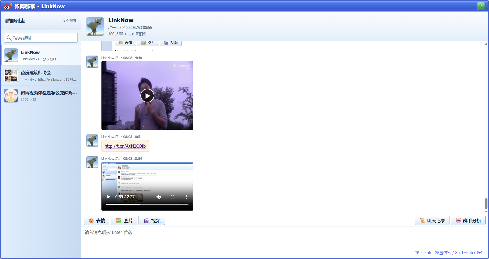
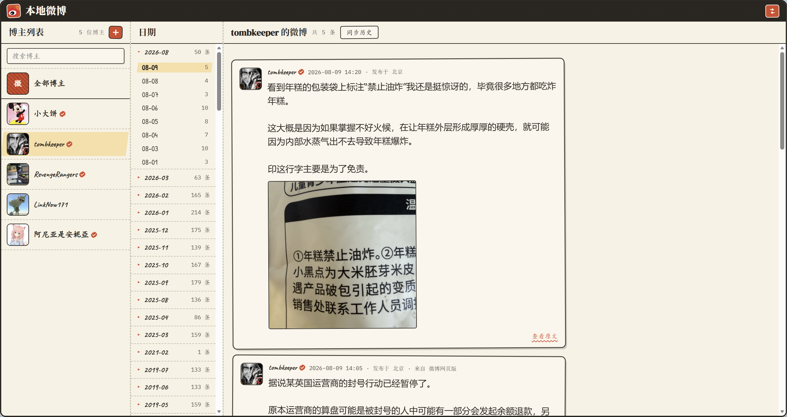
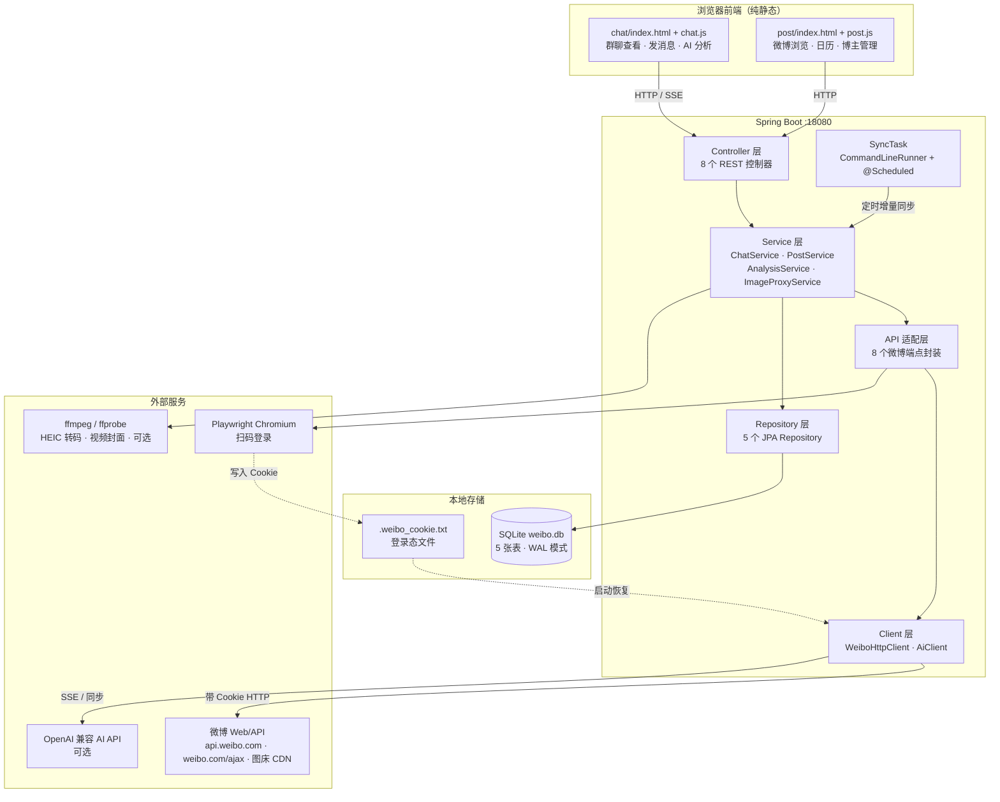

# vb-weibo-plus

本机单用户微博客户端。用一个微博账号扫码登录后，服务在后台将群聊与博主发布的最新微博增量同步到本地 SQLite，并提供两个网页界面：

- **本地微博**：添加博主，按日历浏览某一天的微博，支持按时间范围同步历史微博
- **微博群聊**：查看群聊消息、发送文字/图片/视频，可选接入 OpenAI 兼容模型的 AI 分析

所有微博图片、视频经本地服务代理后直接在浏览器预览，无需在浏览器中登录微博。

## 页面预览

### 微博群聊



### 本地微博



## 系统架构

### 整体分层



## 前置条件

- **JDK 21**
- **Maven 3.9+**
- **ffmpeg**（可选，但推荐安装）：群聊图片预览在遇到 HEIC 格式（苹果设备原图，微博会错标为 image/jpeg）时，依赖系统 ffmpeg 将其转码为 JPEG 以便桌面浏览器显示。未安装时 HEIC 图片会原样透传（浏览器无法显示），但不影响其他格式图片和其余功能。

#### ffmpeg 安装

将 ffmpeg 加入系统 PATH 即可，应用启动时会自动探测。

- **Windows**：下载 [ffmpeg](https://ffmpeg.org/download.html) 解压，将其 `bin` 目录加入 PATH；或设置环境变量 `WEIBO_FFMPEG_PATH` 指向 ffmpeg 可执行文件绝对路径。
- **macOS**：`brew install ffmpeg`
- **Linux**：`sudo apt install ffmpeg` 或对应发行版的包管理器。

若 ffmpeg 不在 PATH，可通过环境变量 `WEIBO_FFMPEG_PATH` 指定其路径，例如：

```bash
export WEIBO_FFMPEG_PATH=/path/to/ffmpeg
```

## 启动运行

```bash
mvn spring-boot:run
```

应用默认监听 `http://localhost:18080`。HTTP 接口集合见 `CHAT_API.http`、`POST_API.http`、`WEIBO_API.http`。

也可直接使用 `run.bat` 启动：将打包产物 `weibo-plus.jar` 放到 run.bat 同目录后双击运行。脚本会自动检查 JDK 版本（要求 21 及以上），并以固定参数启动服务（端口 18080、默认同步群号 `4761715839862414`、AI 指向 DeepSeek），启动 5 秒后自动打开群聊页面。如需调整参数，直接修改 run.bat 中 java 命令行的值即可。

### 配置说明

主要配置项在 `src/main/resources/application.yml`，均可通过环境变量覆盖：

| 配置项 | 环境变量 | 默认值 |
|--------|----------|--------|
| `server.port` | - | `18080` |
| `weibo.cookie-file` | - | `.weibo_cookie.txt` |
| `weibo.qr-timeout-seconds` | - | `300` |
| `weibo.database-path` | `WEIBO_DATABASE_PATH` | `weibo.db` |
| `weibo.chat.auto-sync-gids` | `WEIBO_AUTO_SYNC_GIDS` | `4761715839862414` |
| `weibo.chat.sync-group-fixed-delay` | `WEIBO_SYNC_GROUP_FIXED_DELAY` | `20s` |
| `weibo.media.ffmpeg-path` | `WEIBO_FFMPEG_PATH` | `ffmpeg` |
| `weibo.ai.base-url` | `WEIBO_AI_BASE_URL` | 空 |
| `weibo.ai.api-key` | `WEIBO_AI_API_KEY` | 空 |
| `weibo.ai.model` | `WEIBO_AI_MODEL` | `deepseek-v4-flash` |
| `weibo.ai.timeout-seconds` | `WEIBO_AI_TIMEOUT` | `120` |
| `weibo.ai.system-prompt` | `WEIBO_AI_SYSTEM_PROMPT` | `请用中文回复分析结果。` |
| `spring.servlet.multipart.max-file-size` | - | `20MB` |
| `spring.servlet.multipart.max-request-size` | - | `21MB` |

各配置项说明：

- `server.port`：应用监听端口，改端口需直接修改 yml
- `weibo.cookie-file`：登录态 cookie 文件路径
- `weibo.qr-timeout-seconds`：扫码登录等待确认的超时秒数，超时后报「扫码登录超时」
- `weibo.database-path`：本地 SQLite 数据库路径
- `weibo.chat.auto-sync-gids`：定时增量同步的群号，逗号分隔，留空则不同步任何群
- `weibo.chat.sync-group-fixed-delay`：群消息增量同步间隔，支持 `20s` / `30000ms` 等 Duration 写法
- `weibo.media.ffmpeg-path`：ffmpeg 可执行文件路径
- `weibo.ai.base-url`：OpenAI 兼容 API 地址，留空则禁用 AI 分析
- `weibo.ai.api-key`：AI API 密钥
- `weibo.ai.model`：模型名称
- `weibo.ai.timeout-seconds`：AI 请求超时秒数
- `weibo.ai.system-prompt`：系统提示词
- `spring.servlet.multipart.max-file-size`：群聊发图/发视频的单文件上传上限，需容纳手机原图
- `spring.servlet.multipart.max-request-size`：整个 multipart 请求上限，略大于文件上限即可