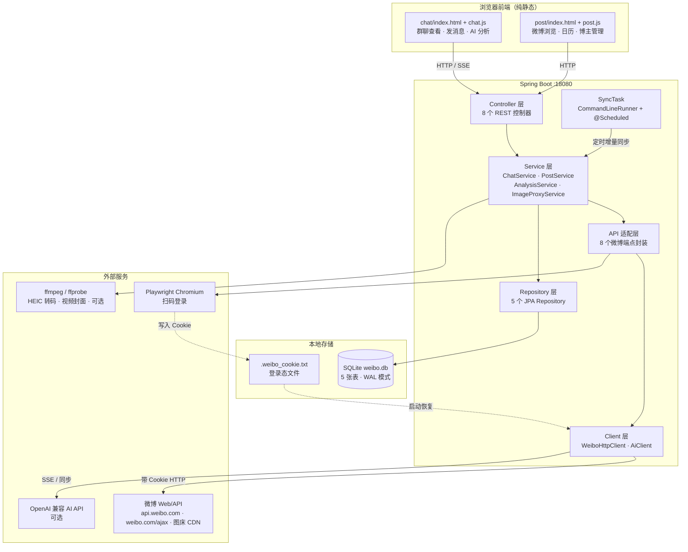

# vb-weibo-plus

单用户本地微博客户端服务。通过本地 Spring Boot 应用驱动一个微博账号的 Web 凭证：扫码登录后，通过 HTTP 接口手动调用微博 Web/API 端点。

## 前置条件

- **JDK 21**
- **Maven 3.9+**
- **ffmpeg**（可选，但推荐安装）：群聊图片预览在遇到 HEIC 格式（苹果设备原图，微博会错标为 image/jpeg）时，依赖系统 ffmpeg 将其转码为 JPEG 以便桌面浏览器显示。未安装时 HEIC 图片会原样透传（浏览器无法显示），但不影响其他格式图片和其余功能。

### 安装 ffmpeg

将 ffmpeg 加入系统 PATH 即可，应用启动时会自动探测。

- **Windows**：下载 [ffmpeg](https://ffmpeg.org/download.html) 解压，将其 `bin` 目录加入 PATH；或设置环境变量 `WEIBO_FFMPEG_PATH` 指向 ffmpeg 可执行文件绝对路径。
- **macOS**：`brew install ffmpeg`
- **Linux**：`sudo apt install ffmpeg` 或对应发行版的包管理器。

若 ffmpeg 不在 PATH，可通过环境变量 `WEIBO_FFMPEG_PATH` 指定其路径，例如：

```bash
export WEIBO_FFMPEG_PATH=/path/to/ffmpeg
```

## 运行

```bash
mvn spring-boot:run
```

应用默认监听 `http://localhost:18080`。HTTP 接口集合见 `CHAT_API.http`、`POST_API.http`、`WEIBO_API.http`。

## 系统架构

### 整体分层



## 配置

主要配置项在 `src/main/resources/application.yml`，均可通过环境变量覆盖：

| 配置项 | 环境变量 | 默认值 | 说明 |
|--------|----------|--------|------|
| `weibo.cookie-file` | - | `.weibo_cookie.txt` | 登录态 cookie 文件路径 |
| `weibo.database-path` | `WEIBO_DATABASE_PATH` | `weibo.db` | 本地 SQLite 数据库路径 |
| `weibo.media.ffmpeg-path` | `WEIBO_FFMPEG_PATH` | `ffmpeg` | ffmpeg 可执行文件路径 |
| `weibo.ai.base-url` | `WEIBO_AI_BASE_URL` | 空 | OpenAI 兼容 API 地址，留空则禁用 AI 分析 |
| `weibo.ai.api-key` | `WEIBO_AI_API_KEY` | 空 | AI API 密钥 |
| `weibo.ai.model` | `WEIBO_AI_MODEL` | `deepseek-v4-flash` | 模型名称 |
| `weibo.ai.timeout-seconds` | `WEIBO_AI_TIMEOUT` | `120` | AI 请求超时秒数 |
| `weibo.ai.system-prompt` | `WEIBO_AI_SYSTEM_PROMPT` | `请用中文回复分析结果。` | 系统提示词 |
