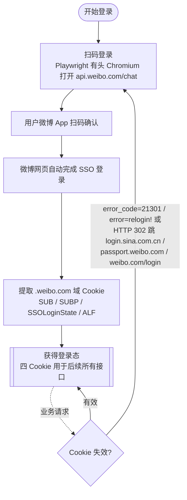

# 公共

说明

- User-Agent
  - Mozilla/5.0 (Windows NT 10.0; Win64; x64) AppleWebKit/537.36 (KHTML, like Gecko) Chrome/126.0.0.0 Safari/537.36
    - 后续所有接口的 User-Agent 均为此值。
- Cookie
  - SUBP=...; ALF=...; SSOLoginState=...; SUB=...（扫码登录获得，详见"扫码登录"）
    - 后续所有接口的 Cookie 均为此四个字段。
- 限流（429）
  - 微博接口被限流时返回 HTTP 429。
  - 应对方式：指数退避重试（4^n 秒，n 为重试次数，最多 3 次），仍失败则放弃。
- Cookie 失效
  - 判定方式一：响应 JSON 中 `error_code` 为 `21301`，`error` 为 `relogin!`。
  - 判定方式二：HTTP 302 重定向到 `login.sina.com.cn` / `passport.weibo.com` / `weibo.com/login`。
  - 应对方式：需重新扫码登录，详见"扫码登录"。
- 414 URI Too Long
  - GET 请求参数过多时微博返回 HTTP 414。

# 登录

登录流程总览（扫码登录获取凭证 + Cookie 失效后重登）：



## 扫码登录

请求

| 参数 | 值 | 说明 |
|------|-----|------|
| URL | https://api.weibo.com/chat | 扫码登录页 |
| 方式 | 浏览器打开 | Playwright 有头 Chromium |

响应

| 字段 | 说明 | 示例值 |
|------|------|--------|
| SUB | 微博唯一登录凭证 | _2A25HVz7MDeRhGedJ4lcS8CbOyjiIHXVk... |
| SUBP | 微博唯一登录凭证 | 0033WrSXqPxfM725Ws9jqgMF55529P... |
| SSOLoginState | 登录时间戳（秒级） | 1783846688 |
| ALF | 有效期截止时间（秒级） | 1786438688 |

原始响应

```
SUB=_2A25HVz7MDeRhGedJ4lcS8CbOyjiIHXVkLT4ErDV8PUNbmtAbLVrmkW9NUYY1E2drJMYiuMg6Vmao4__m9l6mmwRj; SUBP=0033WrSXqPxfM725Ws9jqgMF55529P9D9WhoV6gS9zS-oP7pQWJkquhW5JpX5KzhUgL.Fo2N1K-0ehnEeKB2dJLoI7DeIg4uKJvNeKMp; SSOLoginState=1783846688; ALF=1786438688
```

说明
用 Playwright 启动有头 Chromium 打开 https://api.weibo.com/chat 页面，用户用微博 App 扫码确认后，微博网页内部自动完成 SSO 登录流程，浏览器落入 .weibo.com 域 Cookie。提取 SUB、SUBP、SSOLoginState、ALF 四个字段。SUB/SUBP 为微博唯一登录凭证，扫码登录时获得，后续不刷新。SSOLoginState 为登录时间戳（秒级），ALF 为有效期截止时间（秒级）。后续所有微博接口请求都依赖这四个 Cookie。


# 微博

## 博主微博增量翻页 第 1 页

请求

| 参数 | 值 | 说明 |
|------|-----|------|
| Method | GET | |
| URL | https://weibo.com/ajax/statuses/mymblog | |
| uid | 1795308214 | 博主 uid |
| page | 1 | 页码，从 1 开始 |
| feature | 0 | 固定 |
| since_id | （第 1 页不传） | 上一页响应的 data.since_id |
| User-Agent | Mozilla/5.0 ... Chrome/126.0.0.0 Safari/537.36 | 桌面 UA，规避自动化检测 |
| Referer | https://weibo.com/u/1795308214 | |
| X-Requested-With | XMLHttpRequest | |
| Cookie | SUBP=...; ALF=...; SSOLoginState=...; SUB=... | 扫码登录获得，详见"扫码登录" |

响应

| 字段 | 说明 | 示例值 |
|------|------|--------|
| data.since_id | 下一页翻页用 | 5312356647437845 |
| data.list | 微博列表，按时间从新到旧 | [...] |
| data.list[].id | 微博数字 id | 5319196504230218 |
| data.list[].mblogid | 微博字符串 id | R83o6hKtk |
| data.list[].created_at | 创建时间 | Fri Jul 10 18:18:55 +0800 2026 |
| data.list[].text | 微博正文（长文为摘要） | "转发微博" |
| data.list[].source | 发布来源 | 荣耀Magic7 Pro |
| data.list[].isLongText | 是否长文，true 需调 longtext 补全 | false |
| data.list[].pic_num | 图片数量 | 0 |
| data.total | 总微博数 | 5246 |
| ok | 1 表示成功 | 1 |

原始响应

```json
{
  "data": {
    "since_id": 5312356647437845,
    "list": [
      {
        "id": 5319196504230218,
        "created_at": "Fri Jul 10 18:18:55 +0800 2026",
        "text": "转发微博",
        "source": "荣耀Magic7 Pro",
        "isLongText": false,
        "pic_num": 0,
        "mblogid": "R83o6hKtk"
      }
    ],
    "total": 5246
  },
  "ok": 1
}
```

（原始 20 条，此处只保留第 1 条且仅保留部分字段）

说明
首次不传 since_id，翻页时把上一页响应的 since_id 带上。data.list 按时间从新到旧排列，data.total 为总微博数。list 为空表示翻到底。isLongText=true 的微博需调 longtext 接口补全全文。微博正文里的图片 URL 在 pic_infos 字段中给出，视频 URL 在 page_info 字段中给出，详见"微博图片直链"和"微博视频直链"。

## 博主微博增量翻页 第 2 页

请求

| 参数 | 值 | 说明 |
|------|-----|------|
| Method | GET | |
| URL | https://weibo.com/ajax/statuses/mymblog | |
| uid | 1795308214 | 博主 uid |
| page | 2 | 页码递增 |
| feature | 0 | 固定 |
| since_id | 5312356647437845 | 上一页响应的 data.since_id |
| User-Agent | Mozilla/5.0 ... Chrome/126.0.0.0 Safari/537.36 | 桌面 UA，规避自动化检测 |
| Referer | https://weibo.com/u/1795308214 | |
| X-Requested-With | XMLHttpRequest | |
| Cookie | SUBP=...; ALF=...; SSOLoginState=...; SUB=... | 扫码登录获得，详见"扫码登录" |

响应

| 字段 | 说明 | 示例值 |
|------|------|--------|
| data.since_id | 下一页翻页用 | 5305126049022064 |
| data.list | 微博列表，按时间从新到旧 | [...] |
| data.list[].id | 微博数字 id | 5312356647437845 |
| data.list[].mblogid | 微博字符串 id | R5bs4vcVf |
| data.list[].created_at | 创建时间 | Sun Jun 21 21:19:45 +0800 2026 |
| data.list[].text | 微博正文（长文为摘要） | "我很早就知道 tombkeeper.io..." |
| data.list[].source | 发布来源 | 微博网页版 |
| data.list[].isLongText | 是否长文，true 需调 longtext 补全 | true |
| data.list[].pic_num | 图片数量 | 0 |
| data.total | 总微博数 | 5246 |
| ok | 1 表示成功 | 1 |

原始响应

```json
{
  "data": {
    "since_id": 5305126049022064,
    "list": [
      {
        "id": 5312356647437845,
        "created_at": "Sun Jun 21 21:19:45 +0800 2026",
        "text": "我很早就知道 tombkeeper.io 这个网站，最近又看到群友在群内分享的微博 agent，我也很想做一个，做一个能获取这些数据的工具。不得不说现在 ai 真的很强大，我只是找了一下接口，然后化身产品和测试就把想要的工具实现了。 <a target=\"_blank\" data-pid=6b023ab6ly1ied8thmzq7j21yt11k1dr  href=\"https://wx4.sinaimg.cn/large/6b023ab6ly1ied8thmzq7j21yt11k1dr.jpg\">查看图片</a> //<a href=/n/tombkeeper usercard=\"name=@tombkeeper\">@tombkeeper</a>:有些人不太明白"利用自己的欲望"是什 ...<span class=\"expand\">展开</span>",
        "source": "微博网页版",
        "isLongText": true,
        "pic_num": 0,
        "mblogid": "R5bs4vcVf"
      }
    ],
    "total": 5246
  },
  "ok": 1
}
```

（原始 20 条，此处只保留第 1 条且仅保留部分字段）

说明
since_id 取上一页响应的 data.since_id，page 递增。isLongText=true 的微博需再调 longtext 接口补全全文。

## 长文补全

请求

| 参数 | 值 | 说明 |
|------|-----|------|
| Method | GET | |
| URL | https://weibo.com/ajax/statuses/longtext | |
| id | 5316949752945053 | mymblog 响应中 isLongText=true 的微博 id（数字型） |
| User-Agent | Mozilla/5.0 ... Chrome/126.0.0.0 Safari/537.36 | 桌面 UA，规避自动化检测 |
| Referer | https://weibo.com/u/1795308214 | |
| X-Requested-With | XMLHttpRequest | |
| Cookie | SUBP=...; ALF=...; SSOLoginState=...; SUB=... | 扫码登录获得，详见"扫码登录" |

响应

| 字段 | 说明 | 示例值 |
|------|------|--------|
| data.longTextContent | 长文全文 | "昨天群里发了一篇 TK 的文章..." |
| data.longTextContent_raw | 长文全文（原始） | "昨天群里发了一篇 TK 的文章..." |
| data.isMarkdown | 是否 Markdown | false |
| data.url_struct | URL 结构 | [] |
| ok | 1 表示成功 | 1 |

原始响应

```json
{"ok":1,"data":{"longTextContent":"昨天群里发了一篇 TK 的文章，我在没有仔细阅读的情况下，就自以为是发现了文章中的一个时间错误，并且还把这个"发现"发到了群里。\n过了一会儿，我越想越觉得不对劲，这篇文章是 TK 写的，以 TK 的严谨风格又是一篇面向公众的文章，不可能会出现这种问题。\n于是我问了一下 GPT 发现果然是自己理解错了。\n如果仔细阅读一下文章，这个错误是可以被发现的，但是我却没有发现，因为没有仔细阅读。\n换位思考一下，如果我自己花费时间精力写了一篇文章却被一个不经思考的言论随意指摘，我也会感到气愤。\n想到这我真是很难受，要知道这个群可是个千人群，在这样一个群里发表了这么低级错误的言论，太尴尬了。\n虽然在求助管理员后，管理员帮我撤回了错误的言论，但是这个难受劲一直到现在还有。\n这时候我想起了 TK 的一篇关于记忆力的微博 -- 记忆好是有代价的，之前说错的话，丢人的事，都会一直记住，时不时冒出来，让人感到惭愧和懊恼。\n为了以后不再这样草率，我觉得我有必要把这个难受劲保存下来用于今后的改进。","url_struct":[],"isMarkdown":false,"longTextContent_raw":"昨天群里发了一篇 TK 的文章，我在没有仔细阅读的情况下，就自以为是发现了文章中的一个时间错误，并且还把这个"发现"发到了群里。\n过了一会儿，我越想越觉得不对劲，这篇文章是 TK 写的，以 TK 的严谨风格又是一篇面向公众的文章，不可能会出现这种问题。\n于是我问了一下 GPT 发现果然是自己理解错了。\n如果仔细阅读一下文章，这个错误是可以被发现的，但是我却没有发现，因为没有仔细阅读。\n换位思考一下，如果我自己花费时间精力写了一篇文章却被一个不经思考的言论随意指摘，我也会感到气愤。\n想到这我真是很难受，要知道这个群可是个千人群，在这样一个群里发表了这么低级错误的言论，太尴尬了。\n虽然在求助管理员后，管理员帮我撤回了错误的言论，但是这个难受劲一直到现在还有。\n这时候我想起了 TK 的一篇关于记忆力的微博 -- 记忆好是有代价的，之前说错的话，丢人的事，都会一直记住，时不时冒出来，让人感到惭愧和懊恼。\n为了以后不再这样草率，我觉得我有必要把这个难受劲保存下来用于今后的改进。"}}
```

说明
id 为 mymblog 响应中 isLongText=true 的微博 id（数字型）。返回 data.longTextContent 为长文全文。无翻页。

## 博主微博时间范围拉取 第 1 页

请求

| 参数 | 值 | 说明 |
|------|-----|------|
| Method | GET | |
| URL | https://weibo.com/ajax/statuses/searchProfile | |
| uid | 1795308214 | 博主 uid |
| page | 1 | 页码，从 1 开始 |
| starttime | 1783622400 | 起始秒级时间戳（+0800 时区，当天 00:00:00） |
| endtime | 1783708799 | 结束秒级时间戳（+0800 时区，当天 23:59:59） |
| hasori | 1 | 含原创，固定 |
| hasret | 1 | 含转发，固定 |
| hastext | 1 | 含文字，固定 |
| haspic | 1 | 含图片，固定 |
| hasvideo | 1 | 含视频，固定 |
| hasmusic | 1 | 含音乐，固定 |
| User-Agent | Mozilla/5.0 ... Chrome/126.0.0.0 Safari/537.36 | 桌面 UA，规避自动化检测 |
| Referer | https://weibo.com/u/1795308214 | |
| X-Requested-With | XMLHttpRequest | |
| Cookie | SUBP=...; ALF=...; SSOLoginState=...; SUB=... | 扫码登录获得，详见"扫码登录" |

响应

| 字段 | 说明 | 示例值 |
|------|------|--------|
| data.list | 微博列表，按时间从新到旧 | [...] |
| data.list[].id | 微博数字 id | 5319196504230218 |
| data.list[].mblogid | 微博字符串 id | R83o6hKtk |
| data.list[].created_at | 创建时间 | Fri Jul 10 18:18:55 +0800 2026 |
| data.list[].text | 微博正文（长文为摘要） | "转发微博" |
| data.list[].source | 发布来源 | 荣耀Magic7 Pro |
| data.list[].isLongText | 是否长文，true 需调 longtext 补全 | false |
| data.list[].pic_num | 图片数量 | 0 |
| data.total | 该时间段总微博数 | "2" |
| data.absstr | 摘要字符串 | "" |
| ok | 1 表示成功 | 1 |

原始响应

```json
{
  "data": {
    "list": [
      {
        "id": 5319196504230218,
        "created_at": "Fri Jul 10 18:18:55 +0800 2026",
        "text": "转发微博",
        "source": "荣耀Magic7 Pro",
        "isLongText": false,
        "pic_num": 0,
        "mblogid": "R83o6hKtk"
      }
    ],
    "total": "2",
    "absstr": ""
  },
  "ok": 1
}
```

（原始 2 条，此处只保留第 1 条且仅保留部分字段）

说明
starttime / endtime 为秒级时间戳（+0800 时区），对应目标日期的 00:00:00 到 23:59:59。page 从 1 开始翻页，纯 page 翻页无 since_id。data.list 按时间从新到旧排列，data.total 为该时间段总微博数。list 为空表示该时间段翻完。list 中的微博结构与 mymblog 相同，pic_infos 和 page_info 字段同样含图床直链。

## 博主微博时间范围拉取 第 2 页

请求

| 参数 | 值 | 说明 |
|------|-----|------|
| Method | GET | |
| URL | https://weibo.com/ajax/statuses/searchProfile | |
| uid | 1795308214 | 博主 uid |
| page | 2 | 页码递增 |
| starttime | 1783622400 | 起始秒级时间戳，与第 1 页相同 |
| endtime | 1783708799 | 结束秒级时间戳，与第 1 页相同 |
| hasori | 1 | 含原创，固定 |
| hasret | 1 | 含转发，固定 |
| hastext | 1 | 含文字，固定 |
| haspic | 1 | 含图片，固定 |
| hasvideo | 1 | 含视频，固定 |
| hasmusic | 1 | 含音乐，固定 |
| User-Agent | Mozilla/5.0 ... Chrome/126.0.0.0 Safari/537.36 | 桌面 UA，规避自动化检测 |
| Referer | https://weibo.com/u/1795308214 | |
| X-Requested-With | XMLHttpRequest | |
| Cookie | SUBP=...; ALF=...; SSOLoginState=...; SUB=... | 扫码登录获得，详见"扫码登录" |

响应

| 字段 | 说明 | 示例值 |
|------|------|--------|
| data.list | 空列表表示该时间段已翻完 | [] |
| data.total | 0 表示无更多 | 0 |
| ok | 1 表示成功 | 1 |

原始响应

```json
{"data":{"list":[],"total":0},"ok":1}
```

说明
page 递增，starttime / endtime 保持不变。list 为空且 total=0 表示该时间段已翻完。本例第 1 页只有 2 条，第 2 页即空。

## 微博图片直链

请求

| 参数 | 值 | 说明 |
|------|-----|------|
| Method | GET | |
| URL | https://wx2.sinaimg.cn/orj960/6b023ab6ly1ieoebpuuwfj20u01tmdjw.jpg | 图床直链 |
| User-Agent | Mozilla/5.0 ... Chrome/126.0.0.0 Safari/537.36 | 桌面 UA，规避自动化检测 |
| Referer | https://weibo.com/ | 绕过防盗链 |

响应

| 字段 | 说明 | 示例值 |
|------|------|--------|
| Content-Type | 图片 MIME 类型 | image/jpeg |
| 响应体 | 二进制图片数据 | （省略） |

原始响应

```
（二进制图片数据）
```

说明
微博正文图片 URL 在 mymblog / searchProfile 响应的 mblog.pic_infos 字段中给出。pic_infos 是字典，key 为 pid，value 含多种尺寸直链。同一张图的 URL 路径只有尺寸标识不同：wap180（缩略图，约 180px）、wap360（中图，约 360px）、orj960（大图，约 960px）、orj1080（原图，约 1080px）、large（最大尺寸）、mw2000（2000px 宽）。请求时带 Referer: https://weibo.com/ 绕过防盗链。pic_infos 结构示例：

```json
{
  "thumbnail": {"url": "https://wx2.sinaimg.cn/wap180/6b023ab6ly1ieoebpuuwfj20u01tmdjw.jpg", "width": 82, "height": 180},
  "bmiddle": {"url": "https://wx2.sinaimg.cn/wap360/6b023ab6ly1ieoebpuuwfj20u01tmdjw.jpg", "width": 164, "height": 360},
  "large": {"url": "https://wx2.sinaimg.cn/orj960/6b023ab6ly1ieoebpuuwfj20u01tmdjw.jpg", "width": 960, "height": 2099},
  "original": {"url": "https://wx2.sinaimg.cn/orj1080/6b023ab6ly1ieoebpuuwfj20u01tmdjw.jpg", "width": 1080, "height": 2362},
  "largest": {"url": "https://wx2.sinaimg.cn/large/6b023ab6ly1ieoebpuuwfj20u01tmdjw.jpg", "width": 1080, "height": 2362},
  "mw2000": {"url": "https://wx2.sinaimg.cn/mw2000/6b023ab6ly1ieoebpuuwfj20u01tmdjw.jpg", "width": 1080, "height": 2362},
  "pic_id": "6b023ab6ly1ieoebpuuwfj20u01tmdjw"
}
```

## 微博视频直链

请求

| 参数 | 值 | 说明 |
|------|-----|------|
| Method | GET | |
| URL | http://f.video.weibocdn.com/o0/9du3qRaklx08z5gOX4Fi01041208eFvz0E030.mp4?... | 视频流直链 |
| User-Agent | Mozilla/5.0 ... Chrome/126.0.0.0 Safari/537.36 | 桌面 UA，规避自动化检测 |
| Referer | https://weibo.com/ | 绕过防盗链 |

响应

| 字段 | 说明 | 示例值 |
|------|------|--------|
| Content-Type | 视频 MIME 类型 | video/mp4 |
| 响应体 | 二进制视频数据 | （省略） |

原始响应

```
（二进制视频数据）
```

说明
微博正文视频 URL 在 mymblog / searchProfile 响应的 mblog.page_info 字段中给出。page_info 含封面图直链（page_pic，图床格式，请求方式同"微博图片直链"）和视频流直链（media_info.stream_url / stream_url_hd / mp4_720p_mp4，f.video.weibocdn.com 域名）。stream_url 为标清（852x480），mp4_720p_mp4 为 720p。duration 为视频时长（秒）。视频流 URL 带 Expires 和 ssig 签名，有时效性。page_info 结构示例：

```json
{
  "type": 5,
  "object_type": "video",
  "page_pic": "https://wx4.sinaimg.cn/orj480/66fd066bly1ieyh61pqoxj21hc0u078l.jpg",
  "media_info": {
    "stream_url": "http://f.video.weibocdn.com/o0/p5XvBOYllx08z5gOmEXK010412046ZIU0E020.mp4?label=mp4_hd&template=852x480.25.0&ori=0&ps=1CwnkDw1GXwCQx&Expires=1783848130&ssig=VoDQBpiAvE&KID=unistore,video",
    "stream_url_hd": "http://f.video.weibocdn.com/o0/p5XvBOYllx08z5gOmEXK010412046ZIU0E020.mp4?label=mp4_hd&template=852x480.25.0&ori=0&ps=1CwnkDw1GXwCQx&Expires=1783848130&ssig=VoDQBpiAvE&KID=unistore,video",
    "mp4_720p_mp4": "http://f.video.weibocdn.com/o0/9du3qRaklx08z5gOX4Fi01041208eFvz0E030.mp4?label=mp4_720p&template=1280x720.25.0&ori=0&ps=1CwnkDw1GXwCQx&Expires=1783848130&ssig=odUUCcEIyZ&KID=unistore,video",
    "duration": 2107,
    "format": "mp4"
  }
}
```

# 群聊

## 群聊列表

请求

| 参数 | 值 | 说明 |
|------|-----|------|
| Method | GET | |
| URL | https://api.weibo.com/webim/2/direct_messages/contacts.json | |
| source | 209678993 | 固定 |
| t | 1783844551087 | 当前毫秒时间戳 |
| count | 50 | 固定 |
| special_source | 3 | 固定 |
| add_virtual_user | 3,4 | 固定 |
| is_include_group | 0 | 固定 |
| need_back | 0,0 | 固定 |
| is_include_folder | 1 | 固定 |
| User-Agent | Mozilla/5.0 ... Chrome/126.0.0.0 Safari/537.36 | 桌面 UA，规避自动化检测 |
| Referer | https://weibo.com/ | |
| Cookie | SUBP=...; ALF=...; SSOLoginState=...; SUB=... | 扫码登录获得，详见"扫码登录" |

响应

| 字段 | 说明 | 示例值 |
|------|------|--------|
| totalNumber | 联系人总数 | 152 |
| contacts | 联系人数组，包含群聊与单聊 | [...] |
| contacts[].user.id | 群 gid<br />（后续 query_messages 的 id 参数） | 4761715839862414 |
| contacts[].user.type | 2 为群聊（其他忽略） | 2 |
| contacts[].user.name | 群名 | 茧房建筑师协会 |
| contacts[].user.member_count | 群成员数 | 0 |
| contacts[].user.max_member_count | 群最大成员数 | 1000 |
| contacts[].user.avatar_large | 群头像 URL | https://wx1.sinaimg.cn/thumbnail/53899d01... |
| contacts[].user.creator | 群主 uid | 1401527553 |
| contacts[].user.group_type | 群类型 | 3 |

原始响应

```json
{
  "totalNumber": 152,
  "contacts": [
    {
      "user": {
        "id": 4761715839862414,
        "type": 2,
        "name": "茧房建筑师协会",
        "member_count": 0,
        "max_member_count": 1000,
        "avatar_large": "https://wx1.sinaimg.cn/thumbnail/53899d01ly8i4bm03nt0bj2050050q3y.jpg?hash=010e9579ff3422604d3765705dfb960f",
        "creator": 1401527553,
        "group_type": 3
      }
    }
  ]
}
```

（原始 51 个，此处只保留第 1 个且仅保留部分字段）

说明
source=209678993、t=当前毫秒时间戳、count=50 固定。contacts 数组包含群聊与单聊，user.type=2 为群聊（其他忽略），user.id 为 gid（后续 query_messages 的 id 参数）。count=50 通常一次返回全部群，无翻页机制。

## 群聊消息 第 1 页

请求

| 参数 | 值 | 说明 |
|------|-----|------|
| Method | GET | |
| URL | https://api.weibo.com/webim/groupchat/query_messages.json | |
| id | 4761715839862414 | 群 gid（contacts 响应的 user.id） |
| count | 50 | 固定 |
| max_mid | （第 1 页不传） | 上一页 messages[0].id |
| convert_emoji | 1 | 固定 |
| query_sender | 1 | 固定 |
| source | 209678993 | 固定 |
| t | 1783844551087 | 当前毫秒时间戳 |
| User-Agent | Mozilla/5.0 ... Chrome/126.0.0.0 Safari/537.36 | 桌面 UA，规避自动化检测 |
| Referer | https://weibo.com/ | |
| Cookie | SUBP=...; ALF=...; SSOLoginState=...; SUB=... | 扫码登录获得，详见"扫码登录" |

响应

| 字段 | 说明 | 示例值 |
|------|------|--------|
| result | true 表示成功 | true |
| messages | 消息列表，按从旧到新排列 | [...] |
| messages[].id | 消息 id（翻页用，取 messages[0].id 作为下一页 max_mid） | 5319836654896760 |
| messages[].gid | 群 gid | 4761715839862414 |
| messages[].type | 消息类型 | 321 |
| messages[].from_uid | 发送者 uid | 1872678284 |
| messages[].content | 消息内容 | "上面这家好像涨了几倍的价格了..." |
| messages[].media_type | 0=文本，1=图片，10=视频，14=链接分享，15=动画表情 | 0 |
| messages[].time | 发送时间（秒级时间戳） | 1783831359 |
| ts | 服务器时间戳 | 1783844550 |

原始响应

```json
{
  "result": true,
  "messages": [
    {
      "id": 5319836654896760,
      "gid": 4761715839862414,
      "type": 321,
      "from_uid": 1872678284,
      "content": "上面这家好像涨了几倍的价格了，可以找其它吡虫啉替代。",
      "media_type": 0,
      "time": 1783831359
    }
  ],
  "ts": 1783844550
}
```

（原始 50 条，此处只保留第 1 条即最旧一条，其 id 用于翻页 max_mid，且仅保留部分字段）

说明
id 为群 gid，count=50、convert_emoji=1、query_sender=1、source=209678993、t=当前毫秒时间戳固定。不传 max_mid 拉最新一批。messages 内部按从旧到新排列，messages[0] 最旧，messages[-1] 最新。翻页时取 messages[0].id 作为下一页的 max_mid。图片和视频消息的媒体文件走 fid + msget 下载接口，详见"群聊媒体文件下载"。

## 群聊消息 第 2 页

请求

| 参数 | 值 | 说明 |
|------|-----|------|
| Method | GET | |
| URL | https://api.weibo.com/webim/groupchat/query_messages.json | |
| id | 4761715839862414 | 群 gid |
| count | 50 | 固定 |
| max_mid | 5319836654896760 | 上一页 messages[0].id |
| convert_emoji | 1 | 固定 |
| query_sender | 1 | 固定 |
| source | 209678993 | 固定 |
| t | 1783844551087 | 当前毫秒时间戳 |
| User-Agent | Mozilla/5.0 ... Chrome/126.0.0.0 Safari/537.36 | 桌面 UA，规避自动化检测 |
| Referer | https://weibo.com/ | |
| Cookie | SUBP=...; ALF=...; SSOLoginState=...; SUB=... | 扫码登录获得，详见"扫码登录" |

响应

| 字段 | 说明 | 示例值 |
|------|------|--------|
| result | true 表示成功 | true |
| messages | 消息列表，按从旧到新排列 | [...] |
| messages[].id | 消息 id（翻页用，取 messages[0].id 作为下一页 max_mid） | 5319808603393784 |
| messages[].gid | 群 gid | 4761715839862414 |
| messages[].type | 消息类型 | 321 |
| messages[].from_uid | 发送者 uid | 2706566322 |
| messages[].content | 消息内容 | "这女孩太厉害了..." |
| messages[].media_type | 0=文本，1=图片，10=视频，14=链接分享，15=动画表情 | 0 |
| messages[].time | 发送时间（秒级时间戳） | 1783824671 |
| ts | 服务器时间戳 | 1783844550 |

原始响应

```json
{
  "result": true,
  "messages": [
    {
      "id": 5319808603393784,
      "gid": 4761715839862414,
      "type": 321,
      "from_uid": 2706566322,
      "content": "这女孩太厉害了，我估计即使是拉拉姐也得甘拜下风",
      "media_type": 0,
      "time": 1783824671
    }
  ],
  "ts": 1783844550
}
```

（原始 50 条，此处只保留第 1 条即最旧一条，其 id 用于翻页 max_mid，且仅保留部分字段）

说明
max_mid 取上一页 messages[0].id（最旧一条），返回比该 mid 更早的消息。messages 同样按从旧到新排列，取本页 messages[0].id 继续翻页。messages 为空表示翻到底。

## 群聊媒体文件下载

请求

| 参数 | 值 | 说明 |
|------|-----|------|
| Method | GET | |
| URL | https://upload.api.weibo.com/2/mss/msget | |
| fid | 5319791961442994 | 文件 id，来自群消息的 fids 字段或 annotations.video_pic_fid 字段 |
| source | 209678993 | 固定 |
| imageType | origin | 仅图片消息附加：origin（原图，默认）、compress（压缩图）。视频封面图不传 |
| Origin | https://web.im.weibo.com | |
| User-Agent | Mozilla/5.0 ... Chrome/126.0.0.0 Safari/537.36 | 桌面 UA，规避自动化检测 |
| Referer | https://web.im.weibo.com/ | |
| Cookie | SUBP=...; ALF=...; SSOLoginState=...; SUB=... | 扫码登录获得，详见"扫码登录" |

响应

| 字段 | 说明 | 示例值 |
|------|------|--------|
| Content-Type | 图片为 image/jpeg 或 image/png，视频为 video/mpeg4 | image/jpeg |
| Content-Length | 文件大小（字节） | 5442983 |
| Content-Disposition | 附件文件名，含原始文件名和时间戳 | attachment;filename="1783820702000.jpg" |
| 响应体 | 二进制文件数据 | （省略） |

原始响应

```
（二进制文件数据，5442983 字节）
```

说明
群聊媒体文件（图片、视频、视频封面图）走 fid + msget 接口下载。fid 来自群消息的 fids 字段（图片 media_type=1、视频 media_type=10）或 annotations.video_pic_fid 字段（视频封面图）。source=209678993 固定。imageType 仅图片消息附加：origin（原图，默认）、compress（压缩图）。视频封面图不传 imageType。无翻页。实测三种场景：
- 图片（media_type=1）：fid=消息 fids[0]，Content-Type: image/png 或 image/jpeg
- 视频（media_type=10）：fid=消息 fids[0]，Content-Type: video/mpeg4，Content-Disposition filename 含 .mp4
- 视频封面图：fid=消息 annotations.video_pic_fid，Content-Type: image/jpeg，Content-Disposition filename 含 .jpg

## 群聊发送图片：初始化文件

请求

| 参数 | 值 | 说明 |
|------|-----|------|
| Method | POST | application/x-www-form-urlencoded |
| URL | https://api.weibo.com/webim/fileplatform/init.json | |
| extprops | {"uploadType":3,"recipientId":5046020575330655} | recipientId 为群 gid，uploadType=3 为群聊 |
| length | 630 | 文件字节数 |
| name | linknow-api-test.png | 原始文件名 |
| type | dm_attachment_pic | 图片固定 |
| md5 | 42509cffa005422b1ca82fb76ff6d4e7 | 文件 MD5 |
| check | 42509cffa005422b1ca82fb76ff6d4e7 | 与 md5 相同 |
| source | 209678993 | 固定 |
| User-Agent | Mozilla/5.0 ... Chrome/126.0.0.0 Safari/537.36 | 桌面 UA |
| Referer | https://api.weibo.com/chat | |
| Cookie | SUBP=...; ALF=...; SSOLoginState=...; SUB=... | 扫码登录获得，详见"扫码登录" |

响应

| 字段 | 说明 | 示例值 |
|------|------|--------|
| fileToken | 本次上传的动态令牌，后续 uploadx 使用 | （省略） |
| length | 分片大小，单位为 KB | 1024 |
| urlTag | 上传节点标识 | 1 |

原始响应

```json
{
  "fileToken": "<动态上传令牌>",
  "length": 1024,
  "urlTag": 1
}
```

说明
先计算整张图片的 MD5，再初始化文件。响应中的 fileToken 仅用于本次上传，文档不记录真实值。实测目标为测试群 LinkNow，gid=5046020575330655。

## 群聊发送图片：上传文件

请求

| 参数 | 值 | 说明 |
|------|-----|------|
| Method | POST | multipart/form-data |
| URL | https://api.weibo.com/webim/uploadx.json | |
| source（query） | 209678993 | 固定 |
| is_chunk（query） | 1 | 启用分片上传 |
| file | （图片二进制） | plupload 生成的文件字段 |
| filetoken | &lt;动态上传令牌&gt; | 来自 fileplatform/init.json |
| startloc | 0 | 当前分片起始偏移；后续分片取上一响应 offset |
| selectId | 5046020575330655 | 群 gid |
| source（form） | 209678993 | 固定 |
| filelength / filecheck / percent | 空字符串 | 网页端固定附带 |
| User-Agent | Mozilla/5.0 ... Chrome/126.0.0.0 Safari/537.36 | 桌面 UA |
| Referer | https://api.weibo.com/chat | |
| Cookie | SUBP=...; ALF=...; SSOLoginState=...; SUB=... | 扫码登录获得，详见"扫码登录" |

响应

| 字段 | 说明 | 示例值 |
|------|------|--------|
| fid | 图片文件 id，发送消息时作为 fids | 5326071291448867 |

原始响应

```json
{"fid":5326071291448867}
```

说明
网页端配置的分片大小来自初始化响应，实测为 1024 KB。630 字节测试图只有 1 个分片。multipart 边界、文件名、chunk 和 chunks 等字段由 plupload 自动生成；核心业务字段如上。

## 群聊发送图片：发送消息

请求

| 参数 | 值 | 说明 |
|------|-----|------|
| Method | POST | application/x-www-form-urlencoded |
| URL | https://api.weibo.com/webim/groupchat/send_message.json | |
| annotations | {"webchat":1,"clientid":"&lt;网页会话 clientid&gt;"} | clientid 为网页聊天会话标识 |
| content | 分享图片 | 网页端固定文案 |
| fids | 5326071291448867 | uploadx 响应的 fid |
| id | 5046020575330655 | 群 gid |
| return_detail | 1 | 返回消息详情 |
| media_type | 1 | 图片固定 |
| source | 209678993 | 固定 |
| User-Agent | Mozilla/5.0 ... Chrome/126.0.0.0 Safari/537.36 | 桌面 UA |
| Referer | https://api.weibo.com/chat | |
| Cookie | SUBP=...; ALF=...; SSOLoginState=...; SUB=... | 扫码登录获得，详见"扫码登录" |

响应

| 字段 | 说明 | 示例值 |
|------|------|--------|
| result | true 表示发送成功 | true |
| mid / id | 新消息 id | 5326071289614715 |
| gid | 群 gid | 5046020575330655 |
| content | 消息文案 | 分享图片 |
| media_type | 图片为 1 | 1 |
| time / ts | 秒级时间戳 | 1785317812 |

原始响应

```json
{
  "from_uid": 1795308214,
  "time": 1785317812,
  "id": 5326071289614715,
  "gid": 5046020575330655,
  "type": 321,
  "content": "分享图片",
  "media_type": 1,
  "result": true,
  "mid": 5326071289614715,
  "ts": 1785317812
}
```

说明
图片发送共 3 步：fileplatform/init 初始化、uploadx 上传、groupchat/send_message 发送。发送成功后，query_messages 返回的图片消息以 fids[0] 保存图片 fid。

## 群聊发送视频：上传封面图

请求

| 参数 | 值 | 说明 |
|------|-----|------|
| Method | POST | multipart/form-data |
| URL | https://api.weibo.com/webim/uploadx.json | |
| source | 209678993 | query 参数，固定 |
| gid | 5046020575330655 | query 参数，群 gid |
| imageName | （PNG 二进制） | 浏览器从视频生成的封面图 |
| User-Agent | Mozilla/5.0 ... Chrome/126.0.0.0 Safari/537.36 | 桌面 UA |
| Referer | https://api.weibo.com/chat | |
| Cookie | SUBP=...; ALF=...; SSOLoginState=...; SUB=... | 扫码登录获得，详见"扫码登录" |

响应

| 字段 | 说明 | 示例值 |
|------|------|--------|
| fid | 视频封面图 fid | 5326071353316787 |
| filename | 服务端文件名 | blob |
| filesize | 封面图字节数 | 18894 |
| extension | 封面图格式 | png |
| thumbnail_60 ... thumbnail_600 | 不同尺寸的封面图下载地址 | https://upload.api.weibo.com/2/mss/msget_thumbnail?... |
| http_code | 200 表示成功 | 200 |

原始响应

```json
{
  "fid": 5326071353316787,
  "vfid": 5326071353316787,
  "tovfid": 5326071353316787,
  "filename": "blob",
  "filesize": 18894,
  "extension": "png",
  "fidstr": "5326071353316787",
  "is_outofdate": false,
  "flag": 0,
  "thumbnail_600": "https://upload.api.weibo.com/2/mss/msget_thumbnail?fid=5326071353316787&high=600&width=600&gid=5046020575330655&size=600,338",
  "http_code": 200
}
```

说明
网页端先从视频提取封面图，再以 imageName 字段上传。返回的 fid 在最终发送消息时写入 annotations.video_pic_fid，不是视频文件本身的 fid。

## 群聊发送视频：初始化文件

请求

| 参数 | 值 | 说明 |
|------|-----|------|
| Method | POST | application/x-www-form-urlencoded |
| URL | https://api.weibo.com/webim/2/multimedia/init.json | |
| extprops | {"uploadType":3,"recipientId":5046020575330655} | recipientId 为群 gid |
| length | 9355 | 视频文件字节数 |
| name | linknow-api-test.mp4 | 原始文件名 |
| type | dm_attachment_video | 视频固定 |
| md5 | 1b5f45f90889d408c7d29f33318ebfc9 | 整个视频的 MD5 |
| check | 1b5f45f90889d408c7d29f33318ebfc9 | 与 md5 相同 |
| mediaprops | 见下方 JSON | 视频属性 |
| source | 209678993 | 固定 |
| User-Agent | Mozilla/5.0 ... Chrome/126.0.0.0 Safari/537.36 | 桌面 UA |
| Referer | https://api.weibo.com/chat | |
| Cookie | SUBP=...; ALF=...; SSOLoginState=...; SUB=... | 扫码登录获得，详见"扫码登录" |

mediaprops 解码后：

```json
{
  "raw_md5": "1b5f45f90889d408c7d29f33318ebfc9",
  "video_type": "dm_video",
  "screenshot": 0,
  "width": 320,
  "height": 180,
  "duration": 2,
  "dm_video_props": {
    "togid": 5046020575330655,
    "touid": 0,
    "gid": 0
  }
}
```

响应

| 字段 | 说明 | 示例值 |
|------|------|--------|
| auth | 分片上传的动态鉴权值，用于 X-Up-Auth | （省略） |
| fileToken | 本次视频上传令牌 | （省略） |
| length | 分片大小，单位为 KB | 4096 |
| threads | 并发上传线程数 | 1 |
| chunk_retry | 分片重试次数 | 30 |
| chunk_timeout | 分片超时，单位为毫秒 | 120000 |
| chunk_read_timeout | 分片读取超时，单位为毫秒 | 30000 |
| media_id | 媒体 id | 5326071353245828 |
| request_id | 请求跟踪 id | req_c52674a8ac1947a3839bbfd1157b640a |

原始响应

```json
{
  "chunk_slow_speed": 100,
  "auth": "<动态上传鉴权>",
  "chunk_delay": 3000,
  "length": 4096,
  "threads": 1,
  "idc": "ali",
  "chunk_retry": 30,
  "chunk_timeout": 120000,
  "fileToken": "<动态上传令牌>",
  "urlTag": "1",
  "media_id": "5326071353245828",
  "request_id": "req_c52674a8ac1947a3839bbfd1157b640a",
  "chunk_read_timeout": 30000
}
```

说明
网页端只接受 MP4 视频，实测代码限制为时长小于 5 分钟且文件小于 100 MB。screenshot=0 表示浏览器成功提取了封面图；如果无法提取则为 1，并在上传完成后轮询首帧接口补封面。

## 群聊发送视频：分片上传

请求

| 参数 | 值 | 说明 |
|------|-----|------|
| Method | POST | application/octet-stream |
| URL | https://up.video.weibocdn.com/2/multimedia/upload.json | |
| name | linknow-api-test.mp4 | 原始文件名 |
| chunk | 0 | 当前分片序号，从 0 开始 |
| chunks | 1 | 总分片数 |
| source | 209678993 | 固定 |
| filetoken | &lt;动态上传令牌&gt; | multimedia/init 响应的 fileToken |
| startloc | 0 | 当前分片起始偏移 |
| selectId | 5046020575330655 | 群 gid |
| check | 1b5f45f90889d408c7d29f33318ebfc9 | 整个文件的 MD5 |
| sectioncheck | 1b5f45f90889d408c7d29f33318ebfc9 | 当前分片的 MD5；单分片时与 check 相同 |
| filelength / filecheck / percent | 空字符串 | 网页端固定附带 |
| X-Up-Auth | &lt;动态上传鉴权&gt; | multimedia/init 响应的 auth，禁止持久化 |
| Origin | https://api.weibo.com | 跨域上传，由浏览器自动附加 |
| User-Agent | Mozilla/5.0 ... Chrome/126.0.0.0 Safari/537.36 | 桌面 UA |
| Referer | https://api.weibo.com/ | |
| 请求体 | 当前视频分片二进制 | 非 multipart |

响应

| 字段 | 说明 | 示例值 |
|------|------|--------|
| fid | 视频文件 fid，发送消息时作为 fids | 5326071357508212 |
| HTTP 状态 | 200 表示当前分片上传成功 | 200 |

原始响应

```json
{"fid":5326071357508212}
```

说明
实测 9355 字节视频只有 1 个分片。浏览器网络面板的响应正文因缓存淘汰未能直接读取，但网页端上传完成回调必须从 JSON 响应读取 fid，且随后 send_message 请求实际使用了 fid=5326071357508212，因此此处响应结构由前端实现与后续请求共同确认。多分片时，startloc 使用上一分片响应的 offset，sectioncheck 使用当前分片 MD5。

## 群聊发送视频：发送消息

请求

| 参数 | 值 | 说明 |
|------|-----|------|
| Method | POST | application/x-www-form-urlencoded |
| URL | https://api.weibo.com/webim/groupchat/send_message.json | |
| annotations | {"video_pic_fid":5326071353316787,"webchat":1,"clientid":"&lt;网页会话 clientid&gt;"} | video_pic_fid 为封面图 fid |
| content | 分享视频 | 网页端固定文案 |
| fids | 5326071357508212 | 视频分片上传响应的 fid |
| id | 5046020575330655 | 群 gid |
| return_detail | 1 | 返回消息详情 |
| media_type | 10 | 视频固定 |
| source | 209678993 | 固定 |
| User-Agent | Mozilla/5.0 ... Chrome/126.0.0.0 Safari/537.36 | 桌面 UA |
| Referer | https://api.weibo.com/chat | |
| Cookie | SUBP=...; ALF=...; SSOLoginState=...; SUB=... | 扫码登录获得，详见"扫码登录" |

响应

| 字段 | 说明 | 示例值 |
|------|------|--------|
| result | true 表示发送成功 | true |
| mid / id | 新消息 id | 5326071357511649 |
| gid | 群 gid | 5046020575330655 |
| content | 消息文案 | 分享视频 |
| media_type | 视频为 10 | 10 |
| time / ts | 秒级时间戳 | 1785317828 |

原始响应

```json
{
  "from_uid": 1795308214,
  "time": 1785317828,
  "id": 5326071357511649,
  "gid": 5046020575330655,
  "type": 321,
  "content": "分享视频",
  "media_type": 10,
  "result": true,
  "mid": 5326071357511649,
  "ts": 1785317828
}
```

说明
视频发送共 4 步：上传封面图、multimedia/init 初始化视频、up.video.weibocdn.com 分片上传视频、groupchat/send_message 发送。发送成功后，query_messages 返回的视频消息以 fids[0] 保存视频 fid，以 annotations.video_pic_fid 保存封面图 fid。
